# Agent 12 — Control flow, event flow & state machines

Bird's-eye codebase map. Deep file dives are owned by other agents; this report stitches them together as flowcharts and tables.

## Files scanned

- `src/main.ts` (1894 LOC) — entry point, DOM injection, event wiring, UI state
- `src/engine/Game.ts` (286 LOC) — engine façade, RAF loop, layer pipeline
- `src/engine/Terminal.ts` (596 LOC) — command dispatcher with grammar
- `src/engine/SkySystem.ts` (402 LOC) — time-of-day evolution, celestial body state, cloud lifecycle
- Skimmed: `src/engine/Layer.ts`, `src/engine/Renderable.ts` (for pipeline shape)

Files explicitly **not** read (other agents own them): `Building.ts`, `CityEntity.ts`, `Ground.ts`, `Landscape.ts`, `Tree.ts`, `TextureGenerator.ts`, `src/procgen/*`, `src/utils/*`.

## Public surface

Surface from a control-flow perspective (not exhaustive — agents 2/6 own that):

- **`Game`** — `constructor(canvas, isPreview?)`, `start()`, `dispose()`, `setSeed/getSeed`, `getCameraX/setCameraX`, `setTimeScale`, `setVolume/getVolume`, `setMuted/getMuted`, `resize()`. Public fields: `generator`, `treeConfig`, `timeScale`, `timeFormat`.
- **`Terminal`** — `constructor(game, onOutput, onClear, onCommandExecuted?)`, `execute(input)`, `getSuggestions(input)`, `cancelPendingReset()`, `registerCommand(cmd)`.
- **`SkySystem`** — `constructor(canvas)`, `update(dt, w)`, `draw(ctx, w, h)`, `getTime()`, `getAmbientColor()`.

## Internal state (the cross-cutting picture)

### Module-scope state in `main.ts` (~1894 LOC, all top-level)

| Variable | Role |
|---|---|
| `game` | Main `Game` instance (singleton at module level) |
| `previewGame` | Lazy second `Game` instance (`isPreview=true`) — only when custom-gen window opens |
| `terminal` | Singleton `Terminal` bound to `game` |
| `commandHistory`, `historyIndex`, `currentInputBuffer` | Terminal command history |
| `terminalHintsList`, `terminalActiveHintIndex` | Tab-completion ring state |
| `currentVolume`, `lastVolume`, `isMuted` | Mute/volume UI state (duplicated in `game`!) |
| `currentAdvSpeedCenter` | Window center for the Advanced speed slider |
| `globalSpeedUpdateCallback` | Cross-handle to sync regular speed slider from Advanced/terminal |
| `isAdvResetConfirming`, `isResetConfirming` | Two-step confirmation flags |
| `isTreeSettingsOpen` | Tree-settings dropdown open/closed |
| `iconIntervals` | `setInterval` handles for the tree icon redraws |
| `isDragging`, `currentSpeedLog`, `MAX_LOG`, `MIN_LOG` | Pointer-lock speed gesture |

### State inside `Game`

`cameraX`, `cameraSpeed=100`, `lastTime`, `isRunning`, `seed`, `treeConfig`, `timeScale=1.0`, `volume=1.0`, `isMuted=false`, `isPreview`, `timeFormat='24h'`, `layers[]`, `generator`, `sky`, `noisePattern`, `scaleFactor=1.6`.

### State inside `Terminal`

`commands: Map<string, Command>` (built-ins registered in constructor) and `pendingResetTarget: string | null` (yes/no two-step gate).

### State inside `SkySystem`

`time: number` (0..24, wraps), `speed=0.1` (game hours per real second), `clouds[]`, `rng: Random` (seeded `Date.now()` — **not** the world seed; clouds are non-deterministic relative to world generation).

## Control flow

### 1. Startup sequence

Step-by-step from `import './style.css'` to first rendered frame.

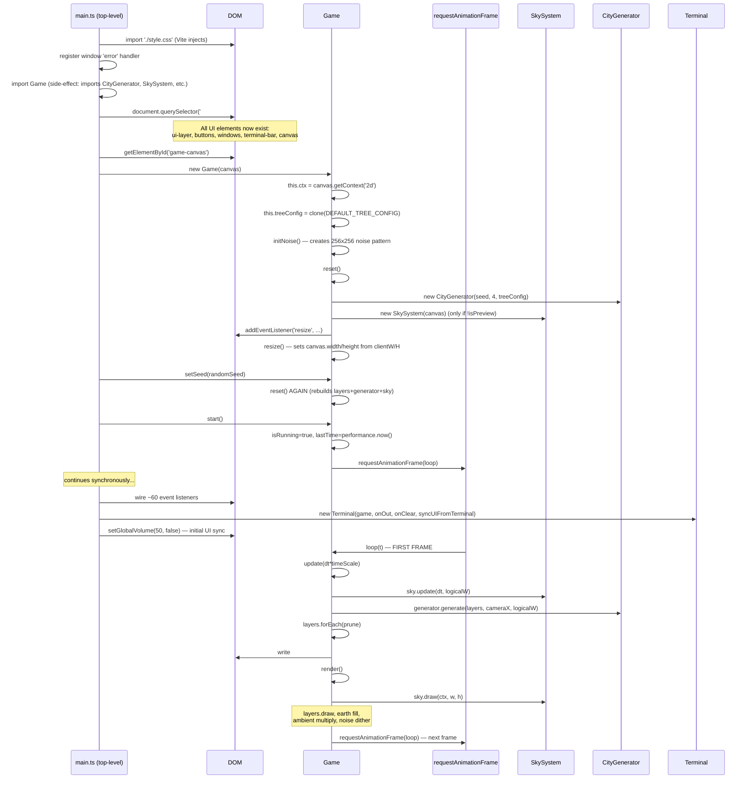

Two interesting wrinkles:

1. **`reset()` runs twice on boot** — once inside the `Game` constructor with seed `"default"`, then again immediately when `main.ts` calls `setSeed(randomSeed)`. Layers/generator/sky are all rebuilt the second time. Cheap but redundant.
2. The DOM is fully synchronous string injection before any handlers are wired — no `DOMContentLoaded` race because Vite serves this as a module.

### 2. The frame tick

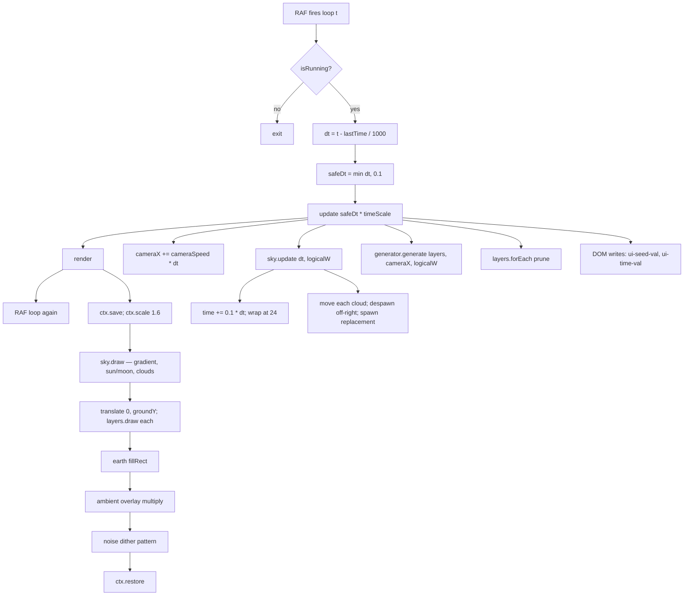

**Timing budget (16.67 ms @ 60 fps)** — not measured, but the visible costs are: 4× layer draw (largely opaque since most procgen is cached in `Layer`/`CityEntity`), 1× sky gradient + ~20 clouds + sun/moon, 1× full-screen multiply overlay, 1× full-screen noise dither, plus 2 DOM `innerText` writes (only on change for seed). The multiply + noise are full-screen per frame and likely the dominant cost.

### 3. User-event flowcharts

#### 3a. Apply seed → effect

Three entry points for "set seed": legacy top-left input, `r` keypress, custom-gen Apply, terminal `seed`. All converge.

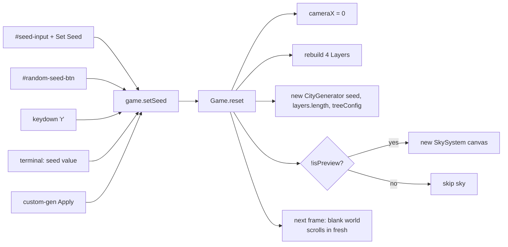

Note: time-of-day **also resets** because a new `SkySystem` is constructed with `time = rng.nextRange(0,24)` seeded from `Date.now()`. Apply-seed therefore randomizes the time-of-day as a side effect.

#### 3b. Speed slider drag → effect

Three sliders feed one number (`game.timeScale`):

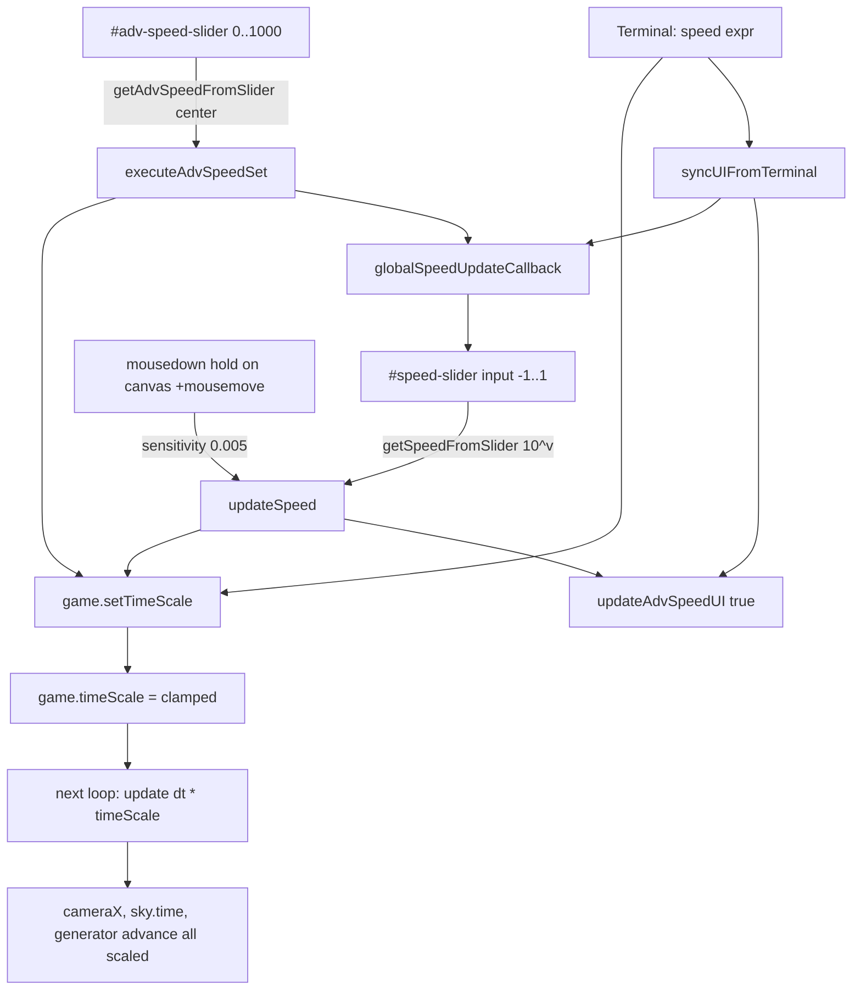

Double-click on slider → snap to 1.0. Double-click on canvas → snap to 1.0. `Math.abs(val) < 0.05` snaps slider to 0 → 1.0 (dead-zone center detent).

#### 3c. Terminal command submit → effect

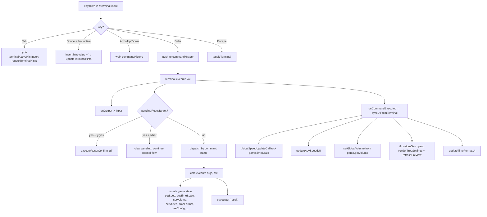

Notable: `reset` (no args) is a **two-step state machine** inside the terminal — the next command (rather than a popup) is consumed as confirmation. See state machines below.

#### 3d. Custom-gen Apply → effect

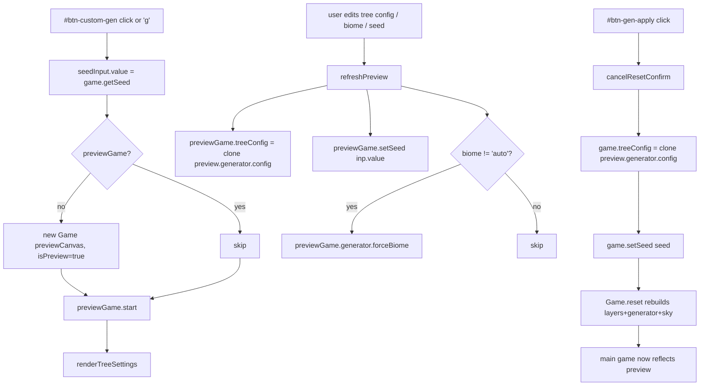

Apply is **pull** from preview → main: main game copies config + seed at the moment Apply is clicked. The preview keeps running its own RAF loop independently until the window closes.

### 4. State machines

Five identifiable state machines in the codebase. Listed by explicitness.

#### SM1 — Terminal grammar (most explicit)

`Terminal.execute()` plus the `pendingResetTarget` field form a real micro-FSM.

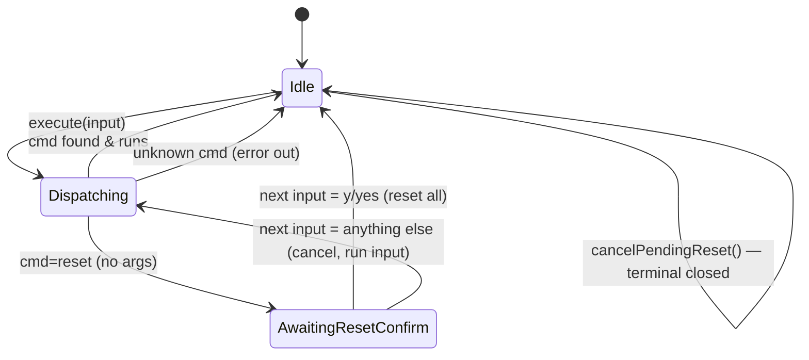

Each individual command also has an arg-count sub-machine, but it's just validation, not real state.

#### SM2 — SkySystem time-of-day & celestial body

`SkySystem.time` is the controlled variable (0..24, wraps). Several derived phases run as continuous interpolations between hard-coded keyframes:

- **Sky gradient**: 17 keyframes, lerped (`getSkyColors`).
- **Ambient multiply overlay**: same keyframes, third channel.
- **Celestial body**: phase machine around the 06:00 and 18:00 boundaries.

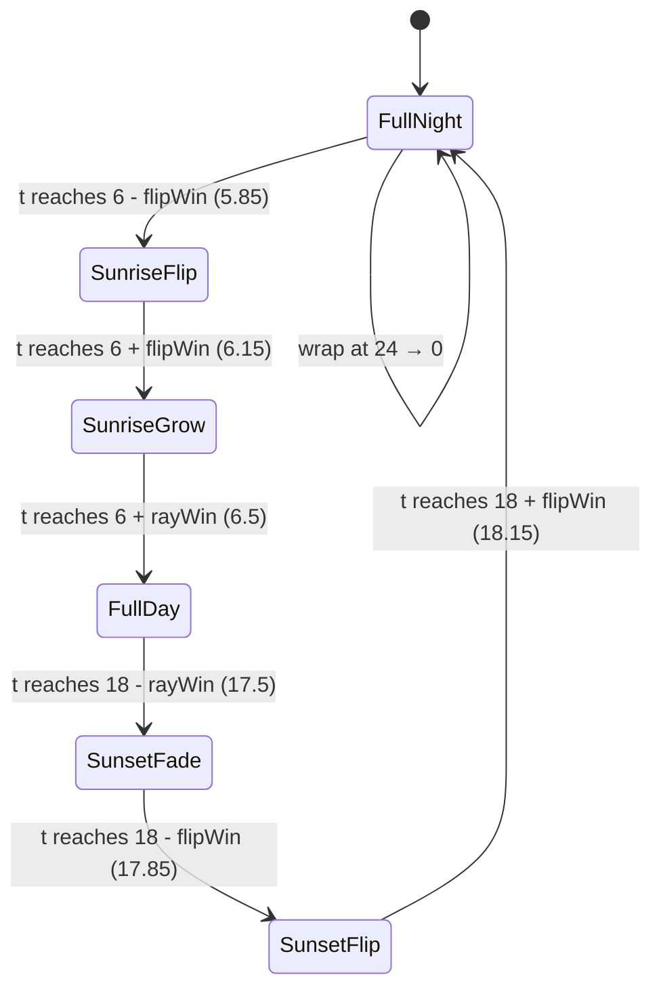

States control `drawSun` boolean, `currentCore` radius (30↔40), `currentBloom` (0..1), and `scaleX` (cosine flip).

#### SM3 — Cloud lifecycle (per-cloud)

```mermaid
stateDiagram-v2
    [*] --> Drifting: createCloud()
    Drifting --> Drifting: x += speed*dt each tick
    Drifting --> Despawned: cloudMinPixel > logicalW
    Despawned --> [*]: splice; createCloud() pushes new one
```

Constant ~20 clouds maintained. Despawn condition is "left edge of cloud is past right edge of screen" (left-to-right scrolling cloud field).

#### SM4 — Modal window visibility (DOM-state machine)

`main.ts` treats `.visible` class as the state. Three windows are mutually exclusive in practice (settings/advanced/customGen). Plus the terminal bar uses `style.display = 'flex'` instead of a class. The Escape key encodes the priority order.

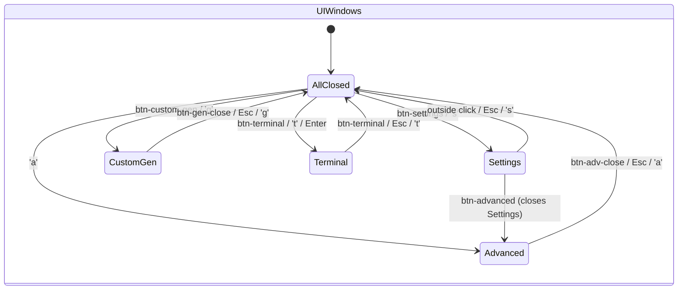

Escape resolution order (highest first): Terminal → CustomGen → Advanced → Settings → pointerLock → native fullscreen exit.

#### SM5 — Two-step confirm buttons

Two near-identical state machines for "Reset Default" in Custom-Gen window and Advanced window:

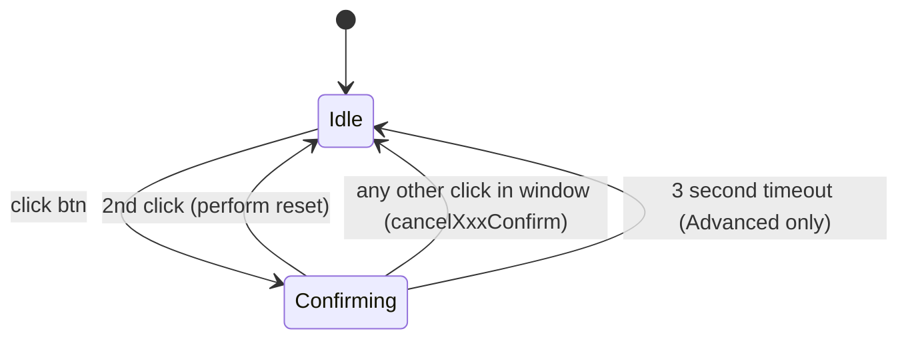

Advanced uses a `setTimeout(cancelAdvResetConfirm, 3000)` — Custom-Gen does not have the timeout, only the click-outside cancel.

#### Smaller stateful toggles (not full FSMs)

- **Mute toggle** — `isMuted` boolean with `lastVolume` memory. Restores prior volume on unmute, falls back to 50 if none stored. Lives in `main.ts` AND is mirrored to `Game.isMuted` via `setMuted`.
- **Fullscreen** — uses browser API state; the code checks `document.fullscreenElement` (with vendor fallbacks).
- **Preview pause** — `previewGame.timeScale === 0` is the "paused" state; pause button swaps icon SVG inline.
- **Tree settings dropdown** — `isTreeSettingsOpen` boolean.
- **Tab-completion ring** — `terminalActiveHintIndex` cycles `0..n-1, -1` (no selection state) on every Tab press.

### 5. Event taxonomy

Every DOM event listened for, grouped by source.

| Source | Event | Handler purpose |
|---|---|---|
| `window` | `error` | Show alert on uncaught errors (main.ts:3) |
| `window` | `resize` | `game.resize()` (Game constructor) |
| `window` | `click` | Close settings on outside-click |
| `window` | `keydown` | Global shortcuts (f/g/r/s/a/m/t/Enter/Esc) |
| `window` | `mousedown` | Start hold-timer for gesture speed |
| `window` | `mouseup` | (inside hold) cancel hold timer |
| `window` | `dblclick` | Snap speed to 1.0 if target is canvas |
| `window` | `wheel` | Scroll = volume change (global) |
| `document` | `mousemove` | Pointer-lock gesture: adjust speed |
| `document` | `mouseup` | End drag, exit pointerLock, hide overlay |
| `#seed-input` | `keydown` | Enter submits applySeed |
| `#set-seed-btn` | `click` | applySeed |
| `#random-seed-btn` | `click` | randomize seed |
| `#ui-seed-val` | `click` | clipboard copy |
| `#ui-time-val` | `click` | clipboard copy |
| `#btn-terminal` | `click` | toggleTerminal |
| `#btn-sound` | `click` | toggle mute |
| `#sound-container` | `mouseenter`/`mouseleave` | show/hide volume popup |
| `#volume-slider` | `input` | setGlobalVolume |
| `#btn-settings` | `click` | toggle settings window |
| `#btn-fullscreen` | `click` | toggleFullscreen |
| `#btn-custom-gen` | `click` | openCustomGen |
| `#btn-advanced` | `click` | open Advanced (close Settings) |
| `#btn-adv-close` | `click` | close Advanced |
| `#btn-adv-reset` | `click` | two-step global reset |
| `#advancedWindow` | `click` | cancelAdvResetConfirm (if not the button) |
| `#timeFmtButtons` (3) | `click` | set `game.timeFormat` |
| `#btn-reset-time-fmt` | `click` | reset to 24h (if modified) |
| `#adv-speed-slider` | `input` | adv speed update (no recenter) |
| `#adv-speed-input` | `change`, `keydown` | text input → eval as JS expression |
| `#btn-reset-adv-speed` | `click` | reset adv speed to 1.0 |
| `#speed-slider` | `input`, `dblclick` | log10 speed mapping; dblclick=reset |
| `#btn-gen-close` | `click` | close custom-gen; clear icon intervals |
| `#btn-gen-apply` | `click` | apply preview config to main game |
| `#btn-gen-reset` | `click` | two-step reset to defaults |
| `#btn-gen-refresh` | `onclick` | refreshPreview |
| `#btn-gen-pause` | `onclick` | toggle previewGame.timeScale |
| `#gen-speed-slider` | `oninput` | previewGame.timeScale |
| `#btn-random-preview-seed` | `onclick` | preserve cameraX, randomize seed |
| `#custom-biome-select` | `change` | refreshPreview with forceBiome |
| `#custom-seed-input` | `keydown` | Enter triggers refreshPreview |
| `#customGenWindow` | `click` | cancelResetConfirm (event delegation) |
| Per-tree `#cb-*` | `onchange` | toggle enabled |
| Per-tree biome buttons | `onclick` | toggle in/out of biomes[] |
| Per-tree `#slider-min/max-*` | `oninput` | live update minHeight/maxHeight |
| Per-tree `#h-min/max-*` | `onchange` | typed numeric override |
| Per-tree `#flower-*` (cactus) | `oninput` | flowerChance update |
| Per-tree `#reset-*` | `onclick` | reset that tree's config |
| `#tree-settings-toggle` | `onclick` | open/close tree settings |
| `#tree-settings-reset-all` | `onclick` | reset all tree configs |
| `#terminal-input` | `input`, `keydown` | hint update; Tab/Space/Enter/ArrowUp/Down |
| Per-line terminal output | `click` | clipboard copy of message |

**Timers**:

- `setTimeout(cancelAdvResetConfirm, 3000)` — Advanced reset auto-cancel
- `setTimeout(() => element.style.color = "", 500)` — clipboard copy feedback fade
- `setTimeout(() => line.classList.remove('terminal-copied'), 300)` — terminal copy feedback
- `setTimeout(... volFadeTimer, 1500)` — volume HUD fade
- `setInterval(drawIcon, 1000)` — tree-config icon animations (one per tree type)
- `requestAnimationFrame(loop)` — the game loop (and the preview loop when open)

### 6. Cross-cutting state

What flows where:

#### main.ts → Game (push)

- Seed (`setSeed`) — destroys layers/generator/sky and rebuilds.
- TimeScale (`setTimeScale`) — read each frame in `loop()`.
- Volume / Muted (`setVolume`, `setMuted`) — currently only logged; not yet wired to actual audio.
- Time format (`game.timeFormat`) — direct field write. Read in `update()` to format the HUD.
- Tree config (`game.treeConfig`) — direct field write, consumed by `reset()` when constructing `CityGenerator`.

#### Game → main.ts (pull)

- `getSeed()` — used by openCustomGen, terminal reset target, refreshPreview fallback.
- `getCameraX/setCameraX` — used by random-preview-seed button to preserve simulation time.
- `getVolume/getMuted` — read by `syncUIFromTerminal` to mirror terminal-driven changes into DOM UI.
- `game.timeScale` — read by `globalSpeedUpdateCallback`, `updateAdvSpeedUI`.
- `game.generator` — main.ts reads `.config`, `.getCurrentBiome()`, `.forceBiome()`.
- `game.treeConfig` — copied to/from preview.

#### Game → SkySystem (push)

- `sky.update(dt, logicalW)` each frame (only main game has sky).
- Sky has no upward signal except `getTime()` and `getAmbientColor()` polled during `update()`/`render()`.

#### Game → CityGenerator (push)

- `generator.generate(layers, cameraX, logicalW)` each frame — generator pushes new entities directly into `layers[].entities`.

#### Terminal → Game (push)

- All terminal commands mutate via `ctx.game.setSeed / setTimeScale / setVolume / setMuted / timeFormat / treeConfig`.

#### Terminal → main.ts (callback)

- `onOutput(msg, isErr)` — appends DOM lines.
- `onClear()` — empties `terminal-output-container`.
- `onCommandExecuted()` → `syncUIFromTerminal()` — pulls fresh `game.*` state back into all the DOM widgets (sliders, volume bar, time-format buttons, tree settings).

#### main.ts → previewGame (push/pull)

- Two-way: preview holds its own generator and treeConfig; refreshPreview copies main game's tree config in some paths but `btn-gen-apply` copies the **other** direction (preview → main).

#### previewGame → CanvasRenderingContext (push only)

Same as Game, but the canvas is the small `#gen-preview-canvas` instead of `#game-canvas`.

### 7. Dualisms & duality patterns observed

#### push vs pull

- **Game state into HUD: push (via mutation) + pull (HUD reads `game.*` each frame).** `update()` writes `#ui-seed-val` / `#ui-time-val` directly during the game loop — DOM updates are scheduled by the engine, not by event handlers. This is the only place where the game actively writes to the DOM each frame.
- **UI → game: pure push.** Every event handler calls a Game setter. No event bus, no observable.
- **Terminal → UI sync: explicit pull via `syncUIFromTerminal`.** After every command, main.ts re-reads game state and writes it back into every widget. Necessary because the terminal bypasses the DOM controls.

#### event-driven vs polled

- **DOM input: event-driven.** Every button/slider has a listener.
- **Animation: polled.** `requestAnimationFrame` polls `lastTime` delta each frame; no event when "a frame is due".
- **Sky time, camera position: polled** (advance each frame by `speed * dt`).
- **Cloud lifecycle: polled** (despawn check each frame).
- **Time-of-day reaching 6:00 or 18:00: polled threshold** (no event; just `if (t >= flipStart && t < flipEnd)`).

#### sync vs async

The codebase is **overwhelmingly synchronous**. The only async surface:
- `requestAnimationFrame` (technically async scheduling, but conceptually a sync loop).
- `navigator.clipboard.writeText().then(...)` — clipboard copy feedback.
- `document.documentElement.requestFullscreen()` returns a Promise in the terminal's `fullscreen` command (`.then().catch()`).
- `setTimeout` / `setInterval` for UI feedback and tree icon redraws.
- **`import('../procgen/TreeConfig').then(...)`** — dynamic ESM import in `reset generate` and `executeResetConfirm('all')`. Curiously async for what is otherwise a statically imported module elsewhere. This is the one true async hot path in the engine logic.

No `async/await` in the project. No Promises chained beyond one level. No `fetch`. No WebWorkers. No AudioContext (despite the volume UI).

#### DOM-state vs game-state

This is the major dualism of the project. The same fact lives in two places, and `syncUIFromTerminal` is the bridge:

| Concept | Game-state | DOM-state |
|---|---|---|
| Volume | `game.volume` (0..1) | `currentVolume` (0..100), `volumeSlider.value`, `lastVolume` |
| Muted | `game.isMuted` | `isMuted` (module), icon SVG innerHTML |
| Time scale | `game.timeScale` | `speedSlider.value`, `advSpeedSlider.value`, `advSpeedInput.value`, `currentAdvSpeedCenter` |
| Time format | `game.timeFormat` | `btn-selected` class on three buttons |
| Seed | `game.seed` | `seedInput.value`, `custom-seed-input.value`, `#ui-seed-val.innerText` |
| Tree config | `game.treeConfig` AND `game.generator.config` | many checkbox/slider/number inputs |
| Pending reset | `terminal.pendingResetTarget` | (none — pure engine) |
| Custom-gen "confirm reset?" | `isResetConfirming` (module) | button innerText + background color |

There's also a triplicate for tree config: `game.treeConfig` ↔ `previewGame.treeConfig` ↔ `previewGame.generator.config`. `refreshPreview` and Apply move config across these.

#### main vs preview (Game vs Game)

The `Game` class is intentionally usable for two purposes via the `isPreview` flag:
- Main: owns sky, listens for window resize, writes to global HUD elements.
- Preview: no sky (sky=null), no resize listener, no HUD writes, smaller canvas. Same RAF loop, same generator, same layers.

This means `update()` and `render()` have `if (!this.isPreview)` and `if (this.sky)` checks scattered through them — a discriminated-union game.

### 8. Invariants

- **`game.isRunning` is a one-way latch flipped on `start()` and only off in error or `dispose()`.** No pause-via-isRunning; pause = `timeScale = 0`.
- **`safeDt = min(dt, 0.1)`** invariant on simulation step — no jump longer than 100 ms regardless of `timeScale` multiplier. This means a 10x-speed run after backgrounding will still only catch up 1 second of sim per frame.
- **Sky time always in [0, 24).** Wrap at 24 → 0 (not modulo — explicit `if`).
- **Cloud count is approximately constant at 20** after init, via 1-out/1-in replacement on despawn.
- **Terminal command names are unique** but aliases share the same `Command` object. `getSuggestions` filters `name === cmd.name.toLowerCase()` to avoid showing aliases as suggestions.
- **`setSeed` always triggers full reset** even if the new seed equals the old one. `btn-gen-apply` exploits this: passing the same seed reloads with new tree config.
- **DOM is fully constructed before any handler runs** (synchronous innerHTML injection at top of main.ts).

### 9. Surprises / risks / TODOs

1. **`Game.loop` keeps requesting frames even after thrown errors caught in the try/catch.** Wait — re-reading: when an exception occurs, `this.isRunning = false`, then `requestAnimationFrame` is still called outside the try. The next loop checks `if (!this.isRunning) return;` so it stops. OK, but the error state is permanent — no recovery path.
2. **`setVolume` and `setMuted` are no-ops** beyond setting fields and `console.log`. There is no audio in the project despite the entire UI for it.
3. **`Function(...)` eval in two places** (`applyAdvInputText` and the `speed` terminal command). User input is evaluated as JS code with `Math` destructured into scope. Risk is low (browser-only, no network input), but it's interesting.
4. **`SkySystem.rng` is seeded with `Date.now()`, not the world seed.** Cloud positions are non-deterministic relative to the world. This means clouds + sky time differ across runs even with the same seed.
5. **Two `reset()` calls during boot.** Layers/generator/sky get built twice. Cheap but wasteful.
6. **Two `btnGenApply` handlers** are registered (`main.ts:698` and `main.ts:1369`). Both run on Apply. Both do essentially the same thing — the later one also calls `cancelResetConfirm()`. Likely a refactor remnant.
7. **`syncUIFromTerminal` references `previewGame` via `typeof previewGame !== 'undefined'`** which is always defined at module scope. The guard is dead code; `if (previewGame ...)` would be the right check (and follows below it).
8. **Pointer-lock gesture speed** can fight with the regular slider — both write `game.timeScale` and read each other's state via `currentSpeedLog` / `speedSlider.value`. They sync via `updateSpeed`.
9. **Mute icon SVG is rewritten via `innerHTML`** every toggle. Inefficient but irrelevant at this scale.
10. **Window `wheel` listener is non-passive by default** (it doesn't read scroll target before deciding). Could affect scroll perf — but with `closest('.ui-window')` and `closest('#terminal-output-container')` early returns it's gated.
11. **No `removeEventListener` anywhere.** Listeners are static for the page lifetime. `previewGame.dispose()` is never called when closing custom-gen — the preview keeps running its RAF loop in the background after the window closes. Look closer: `btn-gen-close` only clears `iconIntervals` and hides the window. The preview `Game.isRunning` stays true. The preview loop continues forever, just rendering offscreen.
12. **`game.treeConfig` and `game.generator.config` can drift apart.** `setSeed` rebuilds the generator from `game.treeConfig`, so they re-sync; but if you mutate one without the other (which `generate` terminal command does — it then calls `setSeed(getSeed())`), there's a window. Apply path copies preview → game.treeConfig, then `setSeed` builds the new generator from `treeConfig`.
13. **Two-step reset confirmations don't share infrastructure.** `isAdvResetConfirming` and `isResetConfirming` are independent flags with copy-pasted handlers.
14. **`cameraSpeed` is hard-coded at 100 px/sec** with no setter. World scroll speed is fixed in `Game.ts`.
15. **TypeScript `as any` cast on `game.setTimeScale`** in `updateSpeed` — unnecessary since `setTimeScale` is public on `Game`.

## Dependencies (imports / imported-by)

`main.ts` imports:
- `./style.css`
- `./engine/Game`
- `./engine/Terminal` (and `AutocompleteSuggestion` type)
- `./engine/Tree` (for Tree class + `TreeType` type, used in icon renders)
- `./procgen/TreeConfig` (`DEFAULT_TREE_CONFIG`)
- `./procgen/BiomeSystem` (`BiomeType`)

`Game.ts` imports:
- `./Layer`
- `../procgen/CityGenerator`
- `../procgen/TreeConfig` (types + default)
- `./SkySystem`

`Terminal.ts` imports:
- `./Game` (type only)
- `./Tree` (`TreeType` only)
- `../procgen/BiomeSystem` (`BiomeType` only)
- Dynamic: `import('../procgen/TreeConfig')` inside two command handlers.

`SkySystem.ts` imports:
- `../utils/Random`

**Imported-by**:
- `Game.ts` — by `main.ts` (twice — preview and main)
- `Terminal.ts` — by `main.ts`
- `SkySystem.ts` — by `Game.ts` (constructed only when `!isPreview`)
- `Layer.ts` — by `Game.ts` (4 instances per reset)

## Complexity & hotspots

- **`main.ts`** is a 1894-line procedural script. The biggest section is `renderTreeSettings` (~400 LOC). Each tree-type loop rebuilds DOM lazily and rebinds events on every render — there's `if (!wrapper)` short-circuits to avoid rebinding.
- **`update()`** in Game is O(layers × entities) for prune + write 2 DOM nodes. The DOM writes are guarded with `innerText !== ...` for seed but not for time (which changes every frame).
- **`render()`** does a multiply blend then a noise dither over the whole canvas every frame — likely the biggest per-frame cost.
- **`SkySystem.draw()`** iterates ~20 clouds and ~5-15 parts each = ~200-300 canvas primitives per frame plus a linear gradient.
- **`Terminal.getSuggestions`** iterates the whole command map and uses `Array.from(this.commands.entries())` plus filter + sort on each keystroke. Trivial size (~13 commands) so fine.

## Dualisms & duality patterns observed

The full dualism inventory is in §7 above. Headline pairs:

- **DOM state vs game state** (the dominant tension — see table).
- **Push (setters from UI) vs pull (`syncUIFromTerminal` reading back game state).**
- **Event-driven UI vs polled simulation.**
- **Main game (`isPreview=false`) vs preview game (`isPreview=true`)** — same class, dual personality.
- **Two-step confirm vs one-shot button.**
- **Static command grammar vs dynamic context-aware suggestions** (terminal commands have an `autocomplete` callback that takes current args).

## Invariants

See §8 above.

## Surprises / risks / TODOs

See §9 above.

## Suggested wiki pages

- `[[entities/Game]]` — engine façade + RAF loop
- `[[entities/Terminal]]` — command grammar + autocomplete
- `[[entities/SkySystem]]` — time-of-day FSM + cloud lifecycle
- `[[concepts/Control Flow]]` — startup, frame tick, event taxonomy (this page condenses to this)
- `[[concepts/State Machines]]` — Terminal grammar, sky phases, modal windows
- `[[concepts/Dualisms — DOM-state vs Game-state]]`
- `[[decisions/Synchronous architecture]]` — why no async, why one big main.ts
- `[[decisions/Preview Game pattern]]` — `isPreview` flag dual-purposing
- `[[risks/Preview Game leak]]` — preview loop runs forever after first open
- `[[risks/Volume is no-op]]` — full UI, no audio backend
