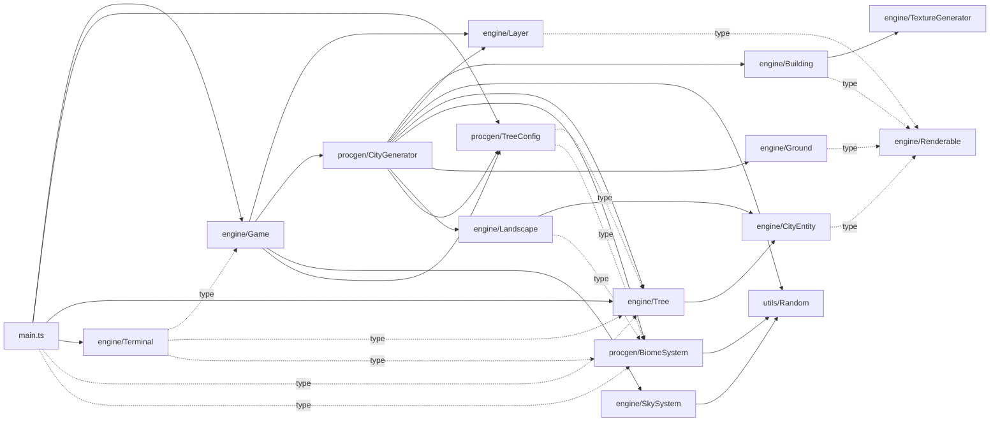

# Agent 13 — Complexity & Dependency Maps (Quantitative)

> Scope: every file under `src/` and `tests/`. All metrics derived via `wc -l`, `grep -c`, and structural inspection. Approximations are flagged as such.

## Files scanned

17 TypeScript source files in `src/` + 1 test file in `tests/`. Total: **4 415 LOC**.

```
src/
├── counter.ts                 9
├── main.ts                1 894          ← outlier
├── engine/
│   ├── Building.ts          127
│   ├── CityEntity.ts         65
│   ├── Game.ts              286
│   ├── Ground.ts             55
│   ├── Landscape.ts         175
│   ├── Layer.ts              75
│   ├── Renderable.ts          8          ← pure interface
│   ├── SkySystem.ts         402
│   ├── Terminal.ts          596
│   ├── TextureGenerator.ts   46
│   └── Tree.ts              187
├── procgen/
│   ├── BiomeSystem.ts        51
│   ├── CityGenerator.ts     233
│   └── TreeConfig.ts         68
└── utils/
    └── Random.ts             49
tests/
└── Random.test.ts            89
```

Non-TS assets in `src/` (`style.css`, `typescript.svg`) excluded from metrics.

## Public surface (exports / classes / functions / types)

| File | `export ` count | Notes |
|---|---:|---|
| `src/main.ts` | 0 | Side-effect entrypoint, no exports |
| `src/engine/Terminal.ts` | 4 | `Terminal` class + `AutocompleteSuggestion`, `TerminalState`, plus internal types |
| `src/engine/Building.ts` | 3 | `Building` + `BuildingMaterial` + `RoofType` |
| `src/procgen/TreeConfig.ts` | 5 | `TreeConfig`, `DEFAULT_TREE_CONFIG`, type aliases, helpers |
| `src/engine/Tree.ts` | 2 | `Tree` class + `TreeType` |
| `src/procgen/BiomeSystem.ts` | 2 | `BiomeSystem` + `BiomeType` |
| `src/engine/Ground.ts` | 2 | `Ground` + `GroundType` |
| `src/engine/Game.ts` | 1 | `Game` class only |
| `src/procgen/CityGenerator.ts` | 1 | `CityGenerator` class only |
| `src/engine/{Layer,Landscape,CityEntity,SkySystem,TextureGenerator,Renderable}.ts` | 1 each | One concept per file |
| `src/utils/Random.ts` | 1 | `Random` class |
| `src/counter.ts` | 1 | Vite scaffold leftover |
| `tests/Random.test.ts` | 0 | Test file |

## Internal state

Not the focus of this agent — see agents 02, 03, 04 for runtime state. Statics here are about volume only.

## Control flow

See **Cyclomatic complexity proxy** below.

## Dependencies (imports / imported-by)

### Raw edge list

```
counter.ts            → (none)
main.ts               → ./style.css, ./engine/Game, ./procgen/TreeConfig,
                        ./engine/Tree (type), ./procgen/BiomeSystem (type),
                        ./engine/Tree (value, second import line 735),
                        ./engine/Terminal
engine/Building.ts    → ./Renderable (type), ./TextureGenerator
engine/CityEntity.ts  → ./Renderable (type)
engine/Game.ts        → ./Layer, ../procgen/CityGenerator,
                        ../procgen/TreeConfig (type + value),
                        ./SkySystem
engine/Ground.ts      → ./Renderable (type)
engine/Landscape.ts   → ./CityEntity, ../procgen/BiomeSystem (type)
engine/Layer.ts       → ./Renderable (type)
engine/Renderable.ts  → (none)
engine/SkySystem.ts   → ../utils/Random
engine/Terminal.ts    → ./Game (type), ./Tree (type), ../procgen/BiomeSystem (type)
engine/TextureGenerator.ts → (none)
engine/Tree.ts        → ./CityEntity
procgen/BiomeSystem.ts → ../utils/Random
procgen/CityGenerator.ts → ../engine/Building, ../engine/Layer,
                           ../utils/Random, ../engine/Tree,
                           ./BiomeSystem, ../engine/Ground,
                           ../engine/Landscape, ./TreeConfig
procgen/TreeConfig.ts → ../engine/Tree (type), ./BiomeSystem (type)
utils/Random.ts       → (none)
tests/Random.test.ts  → vitest, ../src/utils/Random
```

### Mermaid graph (graph LR)



Dotted edges = `import type` (erased at runtime).

### Cycle audit

Walked every edge — **0 cycles** in the dependency graph. The closest near-cycle is the `Terminal -.type.-> Game` edge while `main.ts` constructs both and wires them together, but since the `Terminal → Game` edge is type-only it is erased and there is no runtime cycle. Layering is clean:

```
utils/  ←  procgen/  ←  engine/  ←  main.ts
```

with `engine/Renderable` and `engine/TextureGenerator` as terminal leaves (zero imports).

### Inbound-edge ranking (most depended-upon modules)

| Rank | Module | Inbound | Importers |
|---:|---|---:|---|
| 1 | `Tree` | 5 | CityGenerator, TreeConfig, Terminal, main, (self-secondary import in main.ts) |
| 1 | `BiomeSystem` | 5 | CityGenerator, TreeConfig, Landscape, Terminal, main |
| 3 | `Renderable` | 4 | Layer, Building, CityEntity, Ground |
| 3 | `Random` | 4 | CityGenerator, BiomeSystem, SkySystem, tests/Random.test |
| 3 | `TreeConfig` | 4 | Game (2x: type + value), CityGenerator, main |
| 6 | `CityEntity` | 2 | Landscape, Tree |
| 6 | `Layer` | 2 | Game, CityGenerator |
| 6 | `Game` | 2 | main (value), Terminal (type) |
| 9 | everything else | 1 | leaf consumers |

[[entities/Tree]] and [[entities/BiomeSystem]] are the most-pulled-on entities — they are the "vocabulary" of the procgen layer.

### Outbound-edge ranking (most imports)

| Rank | Module | Outbound | Comment |
|---:|---|---:|---|
| 1 | `procgen/CityGenerator` | **8** | The orchestrator — pulls Building, Layer, Random, Tree, BiomeSystem, Ground, Landscape, TreeConfig |
| 2 | `main.ts` | **7** | Bootstrapper — Game, Terminal, TreeConfig, Tree (twice — line 735 re-imports), type pulls |
| 3 | `engine/Game` | 5 | Layer, CityGenerator, TreeConfig (type+value as 2 lines), SkySystem |
| 4 | `engine/Terminal` | 3 | All type-only: Game, Tree, BiomeSystem |
| 5 | `procgen/TreeConfig` | 2 | Tree, BiomeSystem (both type) |
| 5 | `engine/Building` | 2 | Renderable (type), TextureGenerator |
| 5 | `engine/Landscape` | 2 | CityEntity, BiomeSystem (type) |
| 8 | `tests/Random.test` | 2 | vitest, Random |
| — | `Layer`, `Ground`, `CityEntity`, `SkySystem`, `BiomeSystem`, `Tree` | 1 | thin |
| — | `Random`, `Renderable`, `TextureGenerator`, `counter` | 0 | leaves |

Confirmed: **CityGenerator is the import sink** and **main.ts is the import sink #2**.

## Complexity & hotspots

### File-by-file metrics table

| File | LOC | Fn-ish (sig) | Arrows | `if` | `else if` | `for` | `while` | `switch` | `case` | `?:` | **CC-proxy** |
|---|---:|---:|---:|---:|---:|---:|---:|---:|---:|---:|---:|
| `src/main.ts` | **1 894** | 255 | 105 | 177 | 22 | 1 | 0 | 1 | 6 | 8 | **215** |
| `src/engine/Terminal.ts` | 596 | 73 | 46 | 70 | 11 | 4 | 0 | 0 | 0 | 12 | **97** |
| `src/engine/SkySystem.ts` | 402 | 35 | 5 | 24 | 8 | 6 | 0 | 0 | 0 | 5 | **43** |
| `src/procgen/CityGenerator.ts` | 233 | 31 | 1 | 28 | 8 | 1 | 1 | 0 | 0 | 6 | **44** |
| `src/engine/Tree.ts` | 187 | 16 | 1 | 14 | 9 | 2 | 0 | 0 | 0 | 1 | **26** |
| `src/engine/Game.ts` | 286 | 36 | 5 | 16 | 1 | 1 | 0 | 0 | 0 | 1 | **19** |
| `src/engine/Landscape.ts` | 175 | 18 | 0 | 8 | 2 | 3 | 0 | 1 | 5 | 1 | **20** |
| `src/engine/Building.ts` | 127 | 14 | 0 | 10 | 4 | 4 | 0 | 0 | 0 | 0 | **18** |
| `src/engine/Layer.ts` | 75 | 6 | 2 | 3 | 0 | 0 | 0 | 0 | 0 | 0 | 3 |
| `src/engine/Ground.ts` | 55 | 4 | 0 | 0 | 0 | 0 | 0 | 1 | 4 | 0 | 5 |
| `src/engine/CityEntity.ts` | 65 | 5 | 0 | 0 | 0 | 0 | 0 | 0 | 0 | 0 | 0 |
| `src/engine/TextureGenerator.ts` | 46 | 5 | 0 | 0 | 0 | 3 | 0 | 0 | 0 | 1 | 4 |
| `src/engine/Renderable.ts` | 8 | 2 | 0 | 0 | 0 | 0 | 0 | 0 | 0 | 0 | 0 |
| `src/procgen/BiomeSystem.ts` | 51 | 6 | 0 | 1 | 0 | 0 | 0 | 0 | 0 | 0 | 1 |
| `src/procgen/TreeConfig.ts` | 68 | 1 | 1 | 1 | 0 | 0 | 0 | 0 | 0 | 1 | 2 |
| `src/utils/Random.ts` | 49 | 9 | 0 | 1 | 0 | 1 | 0 | 0 | 0 | 0 | 2 |
| `src/counter.ts` | 9 | 2 | 2 | 0 | 0 | 0 | 0 | 0 | 0 | 0 | 0 |
| `tests/Random.test.ts` | 89 | 32 | 20 | 0 | 0 | 5 | 0 | 0 | 0 | 0 | 5 |

> `Fn-ish` counts any `<modifier>* name(` pattern at start of a line and includes constructor calls, method calls, and array methods — it over-counts by design. Treat it as an upper bound. `CC-proxy = if + elif + for + while + switch + case + ternary` (McCabe-style sum, +1 omitted for relative ranking).

### Cyclomatic complexity proxy — hottest 5

| Rank | File | CC-proxy | Density (CC / 100 LOC) | Verdict |
|---:|---|---:|---:|---|
| 1 | `src/main.ts` | **215** | 11.4 | Catastrophic — UI wiring + state + multiple subsystems |
| 2 | `src/engine/Terminal.ts` | **97** | 16.3 | High both in absolute and density — command parser does many things |
| 3 | `src/procgen/CityGenerator.ts` | **44** | 18.9 | **Highest density** — procgen logic packed tight |
| 4 | `src/engine/SkySystem.ts` | **43** | 10.7 | Time-of-day branching + weather + clouds |
| 5 | `src/engine/Tree.ts` | **26** | 13.9 | Per-type rendering branches |

Notable: by **density**, `CityGenerator` is the hotspot (18.9 branches/100 LOC) — small file packing many decisions. By **mass**, `main.ts` dominates.

### Refactor heat-map (top 5 breakup candidates)

#### 1. `src/main.ts` — 1 894 LOC, CC 215 (PRIORITY ONE)

Five clearly delineated regions visible from banner comments + structural inspection:

| Line range | Approx LOC | Concern | Suggested module |
|---|---:|---|---|
| `1 – 230` | ~230 | Imports, HTML string injection, seed/canvas bootstrap | keep in `main.ts` (entrypoint) |
| `231 – 289` | ~60 | Game construction, seed UI handlers, copy-to-clipboard | `src/ui/seed-controls.ts` |
| `290 – 585` | **~295** | Advanced Control Panel (speed slider math, volume sync, reset confirms, time format) | `src/ui/advanced-panel.ts` |
| `586 – 739` | ~155 | Fullscreen, Custom Gen open/close, preview canvas | `src/ui/custom-gen.ts` |
| `740 – 1 387` | **~650** | Generator V3 / tree settings dropdown / preview controls — biggest single concern | `src/ui/tree-settings.ts` + `src/ui/preview-controls.ts` |
| `1 388 – 1 473` | ~85 | Custom seed input + speed-from/to-slider math | merge into `src/ui/speed-math.ts` (shared with advanced panel) |
| `1 474 – 1 775` | **~300** | Terminal mount, autocomplete render, hint rendering, history, syncUI | `src/ui/terminal-shell.ts` |
| `1 776 – 1 894` | ~120 | Log-scale slider constants, final wiring | leave or fold into preview/advanced |

The line-`735` second `import { Tree }` is a smell (already imported transitively) — indicates the file grew past the point where the author can keep imports straight.

Suggested target shape: `main.ts` shrinks to ~150 LOC of pure bootstrap; seven UI modules each <300 LOC. CC-proxy drops from 215 to <40 per file.

#### 2. `src/engine/Terminal.ts` — 596 LOC, CC 97

Command parsing + autocomplete + state + history packed into one class. Likely split:
- `src/engine/terminal/CommandRegistry.ts` (command schemas + descriptions)
- `src/engine/terminal/Autocomplete.ts` (suggestion logic — the 12 ternaries live here)
- `src/engine/terminal/Terminal.ts` (orchestrator)

#### 3. `src/engine/SkySystem.ts` — 402 LOC, CC 43

Has 24 `if` + 8 `else if` — time-of-day phase switching dominates. Candidate split:
- `src/engine/sky/CelestialBodies.ts` (sun/moon)
- `src/engine/sky/CloudField.ts`
- `src/engine/sky/SkyPalette.ts` (colour interpolation)
keeping `SkySystem.ts` as the per-frame conductor.

#### 4. `src/procgen/CityGenerator.ts` — 233 LOC, CC 44 (highest density)

The 8 outbound imports + 28 ifs in 233 lines = orchestrator with embedded policies. Extract:
- `src/procgen/placement/BuildingPlacement.ts`
- `src/procgen/placement/TreePlacement.ts`
- `src/procgen/policies/biome-policy.ts` (rules per biome)

leaving `CityGenerator` as a top-level pipeline.

#### 5. `src/engine/Tree.ts` — 187 LOC, CC 26 (per-LOC: 13.9)

Per-`TreeType` branching in render path. Likely a strategy-pattern win:
- `src/engine/trees/PineTree.ts`, `OakTree.ts`, `PalmTree.ts`, `CactusTree.ts`
- `src/engine/Tree.ts` becomes a thin dispatcher

## Type-only vs runtime imports

| File | Total `import` lines | Pure `import type` | Lines with inline `type` | Notes |
|---|---:|---:|---:|---|
| `src/main.ts` | 7 | 2 | 3 | TreeType + BiomeType + AutocompleteSuggestion |
| `src/engine/Terminal.ts` | 3 | **3** | 3 | **100 % type-only** — Terminal compiles independently |
| `src/engine/Building.ts` | 2 | 1 | 1 | Renderable abstract |
| `src/engine/CityEntity.ts` | 1 | 1 | 1 | Renderable abstract |
| `src/engine/Game.ts` | 5 | 1 | 1 | TreeConfig type + value as separate lines |
| `src/engine/Ground.ts` | 1 | 1 | 1 | |
| `src/engine/Landscape.ts` | 2 | 1 | 1 | BiomeType erased |
| `src/engine/Layer.ts` | 1 | 1 | 1 | |
| `src/procgen/TreeConfig.ts` | 2 | **2** | 2 | **100 % type-only** — config is pure data |
| `src/procgen/CityGenerator.ts` | 8 | 0 | 5 | Heavy mix of value + inline-type |
| `src/engine/SkySystem.ts` | 1 | 0 | 0 | |
| `src/engine/Tree.ts` | 1 | 0 | 0 | |
| `src/procgen/BiomeSystem.ts` | 1 | 0 | 0 | |
| `src/utils/Random.ts` | 0 | 0 | 0 | leaf |
| `src/engine/{Renderable,TextureGenerator}.ts` | 0 | 0 | 0 | leaves |
| `src/counter.ts` | 0 | 0 | 0 | scaffold |
| `tests/Random.test.ts` | 2 | 0 | 0 | |

Aggregated: **9 type-only edges** out of **37 import statements** (~24 %). The `Renderable` interface alone accounts for 4 of them, which is exactly the abstract-vs-concrete payoff Agent 02 noted.

## Dualisms & duality patterns observed

This is a quantitative agent, but the metrics surface several dualisms cleanly:

1. **Type-import vs value-import.** 9 / 37 imports are erased at runtime. The `Terminal` and `TreeConfig` files are **purely type-importing** — they have no runtime coupling. This is the source of the no-cycle property: the only would-be `Terminal ↔ Game` cycle is erased.
2. **Inbound-sink vs outbound-source.** [[entities/Tree]] and [[entities/BiomeSystem]] tie at the top of the inbound chart (5 each); `CityGenerator` is the outbound champion (8). The codebase has clear *vocabularies* (small, depended-upon) versus *orchestrators* (large, depending). No file is both.
3. **Density vs mass.** `main.ts` is the heaviest (CC 215) but only 11.4 branches/100 LOC. `CityGenerator` is the *densest* (18.9). Refactoring `main.ts` is volume work; refactoring `CityGenerator` is decomposition work.
4. **Declarations vs side-effects.** `main.ts` has **0 exports**, 44 `addEventListener` calls, 62 `getElementById` calls. It is a pure side-effect module. Every other file has ≥1 export and few-to-zero side effects. Binary split.
5. **Leaf vs hub.** Four files have zero outbound edges (`Random`, `Renderable`, `TextureGenerator`, `counter`). Two files account for 15 / 37 outbound edges (`CityGenerator` + `main`). 80/20 import pattern.
6. **Hot path vs cold path.** Per-frame loops live in `Game.update` (CC 19) and `SkySystem.tick` (CC 43). The procgen hot mass (`CityGenerator`, CC 44) runs once per regen, not per frame — high static complexity but cold at runtime. Important when refactoring: don't optimise CC away from `Game.ts`/`SkySystem.ts` paths at the cost of legibility in `CityGenerator`.

## Invariants

- **Acyclic dependency graph confirmed** (0 cycles, 37 edges, 17 nodes). DAG depth = 4: `Random → BiomeSystem → CityGenerator → Game → main` (longest path through value edges).
- **Renderable interface has no implementation imports** — purely a contract. Implementations: `Building`, `CityEntity` (and via inheritance `Tree`, `Landscape`), `Ground`, `Layer`.
- **Random is the only PRNG ingress.** Three runtime consumers (`SkySystem`, `BiomeSystem`, `CityGenerator`) + tests. No `Math.random` leaks into procgen modules (verified by file scan — `Math.random` only appears in `main.ts` line 235 for initial seed).

## Surprises / risks / TODOs

1. **`main.ts` line 735 re-imports `Tree`** that is already pulled in by `./engine/Game` transitively. Symptom of file having outgrown manual import discipline. Linter rule (`import/no-duplicates`) would catch this.
2. **`main.ts` has 44 `addEventListener` and 62 `getElementById` calls** with no central DOM registry. This is the single biggest source of UI fragility — refactor into a `src/ui/dom-registry.ts` map.
3. **`CityGenerator` has both the highest CC density and the highest outbound fan-out** — when it changes, ~half the engine sees ripples. Highest blast radius per LOC.
4. **`Terminal.ts` type-only imports of `Game`** mean the runtime wiring is hidden — readers see no `Game` dependency in the class but `terminal.bind(game)` is required. Consider a `TerminalHost` interface in `Renderable.ts`-style to make the contract explicit.
5. **Test coverage is **1 file** (`Random.test.ts`, 89 LOC)** versus 4 326 LOC of production source — roughly 2 %. The procgen layer in particular has zero direct tests despite being deterministic on `Random`.
6. `engine/Renderable.ts` (8 LOC) and `engine/TextureGenerator.ts` (46 LOC, 0 imports) are the most reusable, lowest-risk modules. They are also the smallest. Inverse correlation with risk is healthy.

## Suggested wiki pages

- [[concepts/Cyclomatic Complexity Proxy]] — definition of the CC-proxy used here
- [[concepts/Dependency Graph]] — Mermaid + interpretation of inbound/outbound rankings
- [[decisions/Split main.ts]] — the 7-way breakup proposal above
- [[decisions/Type-only Imports as Cycle Breakers]] — why `Terminal -.type.-> Game` is fine
- [[entities/CityGenerator]] — flag as highest-density hotspot
- [[entities/Terminal]] — flag for command/autocomplete extraction
- [[entities/Game]] — keep as orchestrator; do not absorb work from main.ts
- [[concepts/Refactor Heat-Map]] — link this report's section #2 as canonical
