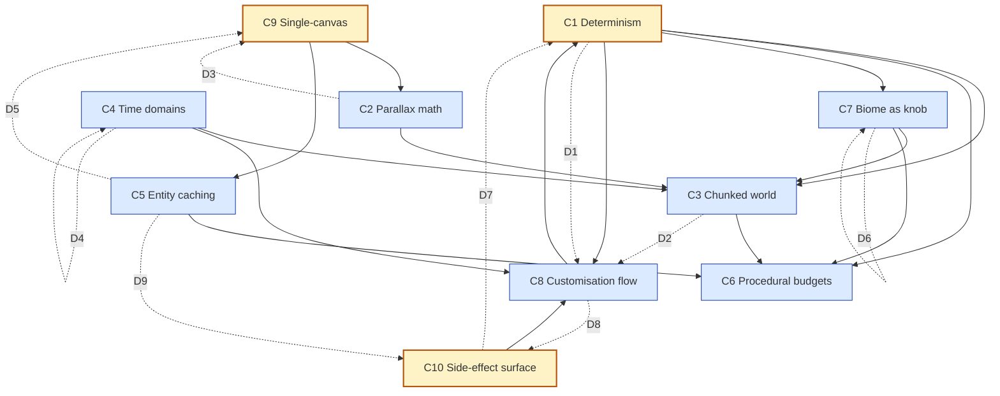

# Agent 15 — Cross-cutting concepts & concept-graph

Scope: identify the *concepts* (not files, not entities) that the codebase embodies, where each lives, the constraints it imposes, and where it's broken on purpose. Cross-referenced with the flat wiki under `skyline-scroller/` for vocabulary, but verified against `src/` rather than trusted blindly.

## Files scanned

- `src/utils/Random.ts`
- `src/engine/Game.ts`
- `src/engine/Layer.ts`
- `src/engine/Renderable.ts`
- `src/engine/CityEntity.ts`
- `src/engine/Building.ts`
- `src/engine/Tree.ts`
- `src/engine/Landscape.ts`
- `src/engine/Ground.ts`
- `src/engine/TextureGenerator.ts`
- `src/engine/SkySystem.ts`
- `src/procgen/CityGenerator.ts`
- `src/procgen/BiomeSystem.ts`
- `src/procgen/TreeConfig.ts`
- `src/main.ts` (skim for customisation surface + DOM coupling)
- `src/engine/Terminal.ts` (skim for seed/biome/reset commands)
- Existing wiki under `skyline-scroller/` for vocabulary only.

## Public surface (exports/classes/functions/types)

This agent doesn't own a single file — the concepts span the public surface of *all* the engine + procgen exports. See agents 02 (Game/Renderable), 05 (landscape/ground), 06 (entities), etc., for per-file enumerations. Below is the *concept-level* surface.

| Concept | Primary anchor in code |
|---|---|
| Determinism | `Random` (`src/utils/Random.ts:4`), `CityGenerator.rng` (`src/procgen/CityGenerator.ts:24`), `BiomeSystem.rng` (`src/procgen/BiomeSystem.ts:20`) |
| Parallax | `Layer.speedModifier` (`src/engine/Layer.ts:5,31,39`), `Layer.yOffset/scale` (`src/engine/Layer.ts:7-8`) |
| Chunked world | `CityGenerator.lastX[]` + `addChunk` (`src/procgen/CityGenerator.ts:18,54,68`), `Layer.prune` (`src/engine/Layer.ts:22`) |
| Time | `Game.lastTime/timeScale` (`src/engine/Game.ts:11,26`), `SkySystem.time/speed` (`src/engine/SkySystem.ts:4-5`), `cameraX` as world-distance clock (`src/engine/Game.ts:14`) |
| Entity caching | `CityEntity.cacheCanvas` (`src/engine/CityEntity.ts:8,18-30`), `Building.cacheCanvas` (`src/engine/Building.ts:18,30,33`) |
| Procedural budgets | `CityDNA` (`src/procgen/CityGenerator.ts:10-14,36-40`), `TreeConfig` height bounds (`src/procgen/TreeConfig.ts:14`), Layer chunk overflow `viewportWidth + 500` (`src/procgen/CityGenerator.ts:52`), prune buffer `2000` (`src/engine/Layer.ts:22`) |
| Biome as design knob | `BiomeType` (`src/procgen/BiomeSystem.ts:3`), `pickMaterial/Roof/Color` (`src/procgen/CityGenerator.ts:196-232`), `Landscape.getColor/getDecorColor` (`src/engine/Landscape.ts:140-154`), `TreeConfig.biomes[]` (`src/procgen/TreeConfig.ts:7,17,...`) |
| Customisation flow | `Game.treeConfig` (`src/engine/Game.ts:21,41`), `Game.setSeed → reset` (`src/engine/Game.ts:86-89,103`), `CityGenerator` accepts injected `config` (`src/procgen/CityGenerator.ts:23,29-33`), main.ts custom-gen window (`src/main.ts:590,703-709,1375-1380`) |
| Single-canvas constraint | `Game.ctx` (`src/engine/Game.ts:10,35`), `Renderable.draw(ctx,…)` (`src/engine/Renderable.ts:6`), composite-multiply ambient (`src/engine/Game.ts:243-251`) |
| Side-effect surface | DOM touches in `Game` (`:50, 65, 183-204`), CityEntity/Building/TextureGenerator each call `document.createElement('canvas')`, Terminal touches fullscreen API, but `Layer`, `Landscape`, `Tree.drawCactus`, `BiomeSystem`, `CityGenerator`, `Random`, `Ground`, `Renderable` are DOM-pure |

## Internal state

The concept-graph below has only a handful of *long-lived* state cells. Worth naming explicitly because most bugs in a side-scroller live in the seams between them:

1. **`Game.cameraX`** — monotonic world-x cursor. Drives parallax view (`cameraX * speedModifier`), chunk generation horizon, and (in `score` time-format) the displayed clock.
2. **`Game.timeScale`** — multiplier applied to the dt fed to `update`. Affects everything except the wall clock used by `requestAnimationFrame` itself.
3. **`Layer.objects[]`** — append-only during generation, pruned from the head only. Implicit ordering by world-x.
4. **`CityGenerator.lastX[layerIndex]`** — per-layer high-water mark in world-x. Bridges parallax math with chunk generation: a layer's "world" is `cameraX * speedModifier`, so `lastX` is in that *layer-local* world.
5. **`BiomeSystem.durationRemaining`** — countdown in *pixels* (not seconds, not chunks), decremented by `dx=1` per call. So the biome clock is implicitly tied to "how often did `update` run" rather than to camera distance — a latent bug, see Surprises.
6. **`SkySystem.time`** — independent 0..24 clock advanced by `dt * speed`, wrapping at 24. Seeded by `Date.now()` so non-deterministic on purpose.
7. **`Game.treeConfig`** — mutable copy of `DEFAULT_TREE_CONFIG`, snapshot-copied into `CityGenerator.config` at `reset()`.

## Control flow

The big arrow:

```
RAF tick →
  Game.loop(t) →
    dt = clamp((t - lastTime)/1000, 0, 0.1)        // wall-clock time
    update(dt * timeScale)                          // game-time
      cameraX += cameraSpeed * dt                   // world distance (also: in-world clock)
      sky.update(dt, logicalW)                      // 0..24 sky-time
      generator.generate(layers, cameraX, w)        // chunk streaming
        biomeSystem.update(1)                       // tick (pixels) — see surprise
        for each layer: while lastX[i] < cameraX*spd + w + 500 → addChunk()
      layer.prune(cameraX)                          // discard objects behind layerViewX - 2000
    render()
      sky.draw                                       // sky gradient + sun/moon + clouds
      ctx.translate(0, groundY); layer.draw[..]    // parallax-translated layers
      fillRect earth strip                          // hide sky below ground
      ctx.globalCompositeOperation='multiply'       // ambient tint
      noisePattern                                  // dither
  RAF next tick
```

Within `Layer.draw`, the parallax mapping is:

```ts
const layerViewX = cameraX * this.speedModifier;
const screenX    = obj.x - layerViewX;
```

So each layer pretends it has its own world coordinate system; the only thing they share is the *real* `cameraX`. Different `speedModifier`s mean the same world-x in one layer doesn't correspond to the same world-x in another — and that's the whole point.

## Dependencies (imports / imported-by, even if known indirectly)

Concept-level dependencies (concrete file imports already covered by other agents):

- Determinism is depended on by: City DNA, biome transitions, chunk geometry, tree picks, building materials/colors/roofs.
- Parallax math is depended on by: Chunked world (`lastX` is in *layer* space), Entity culling, pruning.
- Chunked world is depended on by: Layer, prune, generator's `while` loop.
- Time triplet (wall / dt / world-x / sky-time) is depended on by: Sky, biome durationRemaining (indirectly, via update cadence — leaky), customisation (`timeScale`).
- Entity caching is depended on by: render performance budget — without it, complex paths would re-run per frame.
- Procedural budgets shape: density of chunks (`dna.density`), greenery (`dna.greenery`), chunk widths (200–500 landscape, 60–120+ building, 20–100 gap), prune horizon (2000), generation horizon (`viewportWidth+500`).
- Biome influences: Ground type (`addChunk` lines 91-97), feature pick (`landscape` vs `building/tree`), `pickMaterial/Roof/Color`, `TreeConfig` filter, `Landscape.generateShape/getColor/getDecorColor`.
- Customisation flow couples: terminal/UI DOM → `Game.setSeed/treeConfig/setTimeScale` → `reset()` → new `CityGenerator` → reseeded chunks.
- Single-canvas constraint dictates: render order is the only depth (no z-buffer), composite ops the only "shader", ambient tint via global `multiply` + dither for banding (`Game.render:243-258`).

## Complexity & hotspots

Concept-level hotspots (where multiple concepts collide):

1. **`CityGenerator.addChunk`** — biome × layer-index × DNA × treeConfig × deterministic RNG × chunk width budget all in one method. Highest concept-density site in the codebase.
2. **`Layer.draw` + `Layer.prune`** — encodes parallax math + chunked world + visibility budget. The `layerViewX` formula is the single source of truth for "where is this layer's camera".
3. **`Game.render`** — encodes the single-canvas constraint (sky → layers → earth strip → ambient multiply → noise dither). Order is meaning.
4. **`SkySystem.getSkyColors + drawCelestialBody`** — 17-keyframe color lerp + flip/ray windows. Independent time domain, but its `getAmbientColor()` is consumed by the main `multiply` pass — so it leaks into every pixel.

## Concept catalogue

For each: definition, where it lives, why it matters, counter-example (where the concept is broken or relaxed).

### C1. Determinism `[[concepts/Determinism]]`

- **Def**: A `seed: string|number` should fully determine the visible world (modulo time of day and clouds).
- **Lives in**: `src/utils/Random.ts` (Mulberry32 + cyrb128 string hash), `CityGenerator(seed)` (`src/procgen/CityGenerator.ts:23-26`), `BiomeSystem(seed)` (`src/procgen/BiomeSystem.ts:19-26`).
- **Why**: Reproducibility of cities, sharable seeds, "go back to that one cool skyline".
- **Counter-examples (intentional leaks)**:
  - `Building.generateTexture` uses `Math.random()` for stone noise (`:62`), warm-vs-day window tint (`:74`), per-window present-or-not (`:79`).
  - `TextureGenerator.createWoodPattern` uses `Math.random()` for grain (`:41`).
  - `Landscape.generateShape` city silhouette uses `Math.random()` (`:38`) and `decorate` uses `Math.random()` (`:92`).
  - `Tree.constructor` cactus flower roll uses `Math.random()` (`:34, 37`) — even though `flowerChance` is configured.
  - `Game.initNoise` fills the dither pattern with `Math.random()` (`:75`).
  - `SkySystem` constructs its own `Random(Date.now())` (`:42`) — sky is non-deterministic on purpose (clouds wander, time-of-day starts random).
- **Implication**: "Same seed → same picture" is true at the *macro* level (skyline silhouette, biome run order, chunk widths) and false at the *micro* level (which exact window is lit, where stone noise dots land). A useful, principled compromise — but it's worth being explicit about it in docs.

### C2. Parallax math `[[concepts/Parallax-Math]]`

- **Def**: Multiple layers, each with its own `speedModifier`, render objects offset by `obj.x - cameraX * speedModifier`. Lower `speedModifier` = further back = slower apparent motion.
- **Lives in**: `Layer` (`src/engine/Layer.ts`), `Game.reset` constructs four layers `[0.2, 0.4, 0.6, 1.0]` at `(zIndex 0..3, yOffset 190/100/50/0)` (`src/engine/Game.ts:110-115`).
- **Why**: Fakes depth on a 2D canvas. Render order is fixed by array index (= z-index), so the layer with `speedModifier=0.2` *must* render first (background), `1.0` last (foreground).
- **Constraint**: Each layer has an independent world. `lastX[i]` is in layer-`i` space. You cannot put one object into two layers because its `x` would mean two different things.
- **Counter-examples**:
  - Background layer 0 also gets a `scale=1.3` (`Game.ts:111`) — so the deepest layer is *bigger*, opposite to standard "far things look smaller" parallax. This is deliberate to make hills look mountainous, but it inverts the usual perspective intuition.
  - `yOffset` is hand-tuned per layer, not derived from a perspective formula. Pure aesthetic.

### C3. Chunked world `[[concepts/Chunked-World]]`

- **Def**: Infinite scroll implemented by appending chunks ahead of the camera and pruning behind. No world map; objects exist only between `[layerViewX - 2000, layerViewX + viewportWidth + 500]`.
- **Lives in**: `CityGenerator.generate` (`src/procgen/CityGenerator.ts:45-58`) and `Layer.prune` (`src/engine/Layer.ts:22-36`).
- **Why**: Bounded memory + bounded per-frame draw cost in an "endless" scene.
- **Chunk policy**:
  - Generation horizon: `cameraX * speedModifier + viewportWidth + 500`.
  - Prune horizon: `obj.x + obj.width > layerViewX - 2000`.
  - Chunk widths: landscape 200–500, building 60–120+20·layerIndex, tree `w+10..30`, gap 20–100, water ≥100.
  - Chunks overlap by 1 px (`lastX[i] += chunkWidth - 1`) to avoid hairline seams.
- **Counter-example**: Sky clouds are *not* chunked. `SkySystem.clouds[]` is a fixed-size pool (count=20), pre-populated across the *screen* not the *world*, and recycled when they exit right (`SkySystem.ts:166-182`). So the sky is a separate world model.

### C4. Time (three domains) `[[concepts/Time-Domains]]`

| Domain | Unit | Source | Affects |
|---|---|---|---|
| Wall clock | ms (real) | `performance.now()` via RAF | dt computation only |
| Frame dt | seconds (scaled) | `(t - lastTime)/1000` capped at 0.1, then `*timeScale` | `update(dt)` — i.e. camera motion, sky time, cloud motion |
| World-x clock | pixels of travel | `cameraX += cameraSpeed * dt` | Chunk gen horizon, in-world clock display (`score` mode shows `floor(cameraX)`), parallax view |
| Sky-time | 0..24 hours (loops) | `time += speed(0.1) * dt` | Sky gradient lerp, sun/moon arc, ambient multiply tint |

- **Lives in**: `Game.loop/update` (`src/engine/Game.ts:146-208`), `SkySystem.update` (`src/engine/SkySystem.ts:161-183`), `Game.timeFormat` switches the displayed time between world-x ("score"), 24h and 12h sky-clock (`:189-205`).
- **Why**: Decoupling lets timeScale slow the whole simulation including biome cadence without affecting the framerate; lets sky-time loop while world-x grows unbounded.
- **Counter-example**: `BiomeSystem.update(1)` is called with a hard-coded `dx=1` from `CityGenerator.generate` (`src/procgen/CityGenerator.ts:49`). So biome "duration in pixels" is actually "number of generate ticks". Since `generate` is called every frame but only *creates* chunks when `lastX < limit`, biome decay is *frame-coupled* not *distance-coupled* — a leak between the time domains. See Surprises.

### C5. Entity caching `[[concepts/Entity-Caching]]`

- **Def**: Each entity's pixels are baked once into an off-screen `HTMLCanvasElement` at construction; per-frame draw is a single `drawImage`.
- **Lives in**: `CityEntity.cacheCanvas` + `initCache(padding)` + abstract `drawToCache` (`src/engine/CityEntity.ts:8,18-30`). `Building.generateTexture` does the same pattern without inheriting (`src/engine/Building.ts:33`).
- **Cache key**: implicitly the entity instance — no LRU, no de-duplication. Two identical oaks own two separate canvases.
- **Why**: Procedural draws (gradients, loops, beziers) are expensive; blit is cheap.
- **Constraint**: cache only captures the entity at its *construction* parameters. Day/night tint must be applied *after* blit via the global multiply pass (C9) — windows can't actually light up at night without re-rasterising.
- **Counter-example**: `Ground` does not cache (`src/engine/Ground.ts`) — it draws cheap fillRects directly per frame. `Landscape.draw` *also* does an *extra* `fillRect(screenX-1, y, w+2, 2000)` per frame on top of the blit (`src/engine/Landscape.ts:172-173`) to extend the hill colour below screen — a controlled break of the "all pixels come from the cache" rule.

### C6. Procedural budgets `[[concepts/Procedural-Budgets]]`

- **Def**: All density/quantity knobs are bounded ranges, mostly seed-driven via `CityDNA`. The point is to prevent both empty deserts and walls of skyscrapers.
- **Lives in**:
  - `CityDNA`: density 0.4–0.9, greenery 0.1–0.8, buildingHeight 0.8–1.2 (`src/procgen/CityGenerator.ts:36-40`).
  - Chunk width caps (see C3).
  - Per-layer max width grows with `layerIndex` (`maxW = 120 + layerIndex * 20`, `src/procgen/CityGenerator.ts:129`) — front layer gets larger buildings.
  - Tree height bounds per type per `TreeConfig` (`src/procgen/TreeConfig.ts:14`).
  - Cloud pool of 20 (`SkySystem.ts:49`).
  - Sky keyframes: 17 keyframes covering 24h (`src/engine/SkySystem.ts:8-26`).
- **Why**: Constant performance ceiling; aesthetic guardrails.
- **Counter-example**: There's no *hard* cap on `Layer.objects.length`. Memory is bounded only by `prune` running every frame; if you ever stopped advancing `cameraX`, objects would still be generated *up to* the horizon then stop, but if you set `cameraSpeed` very high without resizing, the horizon expands and the active set could grow large.

### C7. Biome as a design knob `[[concepts/Biome-As-Knob]]`

- **Def**: `BiomeType` is a single enum that simultaneously biases six independent generators: ground type (background layers), feature distribution, building material, roof type, color palette, landscape silhouette, tree species filter.
- **Lives in**: `BiomeSystem` (`src/procgen/BiomeSystem.ts`) with adjacency graph (`:11-17`), consumed in `CityGenerator.addChunk/pickMaterial/pickRoof/pickColor/pickTreeType` (`src/procgen/CityGenerator.ts:91-97, 179-232`), `Landscape.generateShape/getColor/getDecorColor` (`src/engine/Landscape.ts:21-43, 140-154`), `TreeConfig[*].biomes[]` (`src/procgen/TreeConfig.ts`).
- **Constraints that stay constant across biomes**:
  - Chunk size distributions (200–500 landscape, etc.).
  - Parallax layer count and `speedModifier`s.
  - The four "feature" types (building/tree/landscape/none).
  - Sky/time system (a desert at midnight is the same sky as a tundra at midnight — biomes don't affect the sky).
- **Counter-example**:
  - Foreground (`layerIndex === 3`) ignores the biome for ground type — instead picks random `pavement/grass/water` (`src/procgen/CityGenerator.ts:76-90`). The foreground is biome-blind on purpose: a foreground river or pavement strip can appear in any biome.
  - `tundra` is in the adjacency graph (`:11`) but no `BiomeType==='tundra'` branch exists in `pickMaterial` (default fallthrough = brick) — concept underused.

### C8. Customisation flow `[[concepts/Customisation-Flow]]`

- **Def**: User tweaks (seed input, tree config sliders, time-scale, biome force) propagate into deterministic regeneration by cloning state into `Game.treeConfig`, then calling `Game.setSeed` (which calls `reset()`, which rebuilds `CityGenerator(seed, layerCount, treeConfig)`).
- **Lives in**:
  - `Game.setSeed/reset/treeConfig` (`src/engine/Game.ts:21,41,86-89,103-122`).
  - `CityGenerator` accepts injected `config` (`src/procgen/CityGenerator.ts:23,29-33`).
  - `main.ts` Advanced + Custom-Gen windows (`src/main.ts:301-353, 590-720, 1364-1385`) — `previewGame.generator.config` is mutated live, then snapshotted onto `game.treeConfig` on Apply.
  - `Terminal` commands (`seed`, `reset`, `generate`, `force biome`) at `src/engine/Terminal.ts:166-194, 405+, 451`.
- **Why**: Every user action must terminate in either (a) parameter change + reseed, or (b) view-only change. This keeps the world deterministic *after* you stop tweaking.
- **Constraint**: `treeConfig` must be deep-cloned (`JSON.parse(JSON.stringify(...))`) at every hand-off (Game→Generator, Generator→Game, Preview→Live), otherwise mutations would leak across instances. This pattern repeats ~8 times in `main.ts` and `CityGenerator.ts:29-33`.
- **Counter-example**: `CityGenerator.forceBiome` does not reseed — it overwrites `currentBiome` in place (`src/procgen/CityGenerator.ts:60-62` → `BiomeSystem.forceBiome` `:47-50`). So forcing a biome breaks "seed determines biome run" but is *not* a regeneration — already-generated chunks stay. This is a deliberate ergonomic relaxation.

### C9. Single-canvas constraint `[[concepts/Single-Canvas]]`

- **Def**: There is exactly one `<canvas>` and one `CanvasRenderingContext2D`. All depth, lighting, weather, and post-processing must be expressible as a sequence of 2D draw calls (+ composite ops).
- **Lives in**: `Game.ctx` (`src/engine/Game.ts:10,35`), `Renderable.draw(ctx, offsetX)` (`src/engine/Renderable.ts:6`).
- **Implications**:
  - **No z-buffer**: depth = array index in `Game.layers[]`. Render order is the only ordering.
  - **No shader**: ambient tint is done with `ctx.globalCompositeOperation='multiply'` + a single fillRect (`src/engine/Game.ts:243-251`). Dither for banding is a repeating noise pattern at 8/255 alpha (`Game.ts:62-83, 254-258`).
  - **No alpha blending tricks per object**: any object that wants translucency has to bake it into its cache.
  - **Off-screen canvases** (cache, texture, noise) are still 2D contexts — they're scratch space, not a parallel rendering pipeline.
- **Counter-examples**:
  - `ctx.scale(scaleFactor=1.6, …)` (`Game.ts:215`) at the top of `render` is a one-time global resolution multiplier; everything below works in *logical* pixels. So there are really *two* coordinate spaces on the same canvas.
  - `Layer.draw` does its own `ctx.translate(0, -yOffset)` and optional `ctx.scale(scale, scale)` (`src/engine/Layer.ts:53-59`), so each layer is briefly a *sub-canvas* coordinate-wise. Save/restore brackets are load-bearing — drop one and everything cascades.

### C10. Side-effect surface (pure vs. impure) `[[concepts/Side-Effect-Surface]]`

- **Def**: Render code paints into a context passed in from outside; only `Game` (and `Terminal`, `main.ts`) own the DOM.
- **Pure-ish (DOM only to allocate off-screen canvases for caching, no `getElementById`, no listeners)**:
  - `Random`, `BiomeSystem`, `CityGenerator`, `TreeConfig`, `Renderable` (interface), `Ground`, `Layer`.
  - `CityEntity`, `Building`, `Tree`, `Landscape`, `TextureGenerator` — they each `document.createElement('canvas')` for their cache. That's it.
- **DOM-coupled**:
  - `Game` — `window.addEventListener('resize')`, `document.getElementById('ui-seed-val' | 'ui-time-val')` polled every frame in `update` (`:183-204`).
  - `Terminal` — `document.documentElement.requestFullscreen()` (`:370`), DOM IO for the terminal panel.
  - `main.ts` — almost everything, by design. ~1900 lines.
  - `SkySystem` constructor reads `Date.now()` (`:42`) — not DOM, but a non-reproducible env input.
- **Why this matters**: Engine code is testable headless except for the `document.createElement('canvas')` calls, which in vitest you'd polyfill or stub. Determinism (C1) leaks because the impure surface (`Math.random`, `Date.now`) is mixed *inside* otherwise-pure engine modules.
- **Counter-example**: `Game.update` *reads* DOM elements every frame to keep the seed/time UI strings in sync (`:183-204`) — render-loop polling of the DOM instead of an event-based push. Cheap but iconic of where the boundary is fuzzy.

## Dualisms & duality patterns observed

Concept-level dualisms (each is a tension between two of the above):

| # | Dualism | Where the tension shows up | Resolution in code |
|---|---|---|---|
| D1 | **Determinism (C1) ↔ Customisation (C8)** | Forcing a biome doesn't rewind chunks; live-editing `treeConfig` requires explicit reseed | `setSeed` rebuilds generator (clean reset); `forceBiome` mutates in place (lazy override). Both exist intentionally. |
| D2 | **Chunked-world (C3) ↔ Full-world-state (none)** | The world has no canonical past — pruned chunks are unrecoverable | Going "back" is impossible. `cameraX` is monotonic. Seed re-entry restarts at `cameraX=0`. |
| D3 | **Parallax math (C2) ↔ Single-canvas (C9)** | 2D canvas has no depth, so depth = layer-array order | Render order is literally depth order. There is no other depth. |
| D4 | **Wall-clock time ↔ World-x clock (C4)** | "Game time" is sometimes seconds (sky, cloud motion) and sometimes pixels (biome duration, score display) | Both clocks coexist; `BiomeSystem.update(1)` couples a *pixel* counter to *frame* ticks — a quiet leak. |
| D5 | **Entity caching (C5) ↔ Ambient lighting (C9)** | Entities are baked at noon-equivalent colors, so night must be faked by a global multiply | `ctx.globalCompositeOperation = 'multiply'` (Game.ts:246) over the whole scene. Cheap, uniform, can't light individual windows. |
| D6 | **Biome (C7) as foreground knob ↔ Foreground biome-blindness** | Background ground type is biome-driven; foreground ground type is biome-blind random pavement/grass/water | A foreground river runs through a desert. Intentional ergonomic choice. |
| D7 | **Pure draw fns (C10) ↔ `Math.random` inside them** | Building/Landscape/Tree are pure-shape-from-ctor in theory, but call `Math.random()` during cache-bake | Macro-deterministic, micro-noisy. See C1 counter-examples. |
| D8 | **Mutable shared config (C8) ↔ Defensive deep-clone** | `treeConfig` is an object passed by reference, but the codebase always JSON-clones at boundaries | `JSON.parse(JSON.stringify(...))` appears ~8 times as the boundary marker. Deep-clone is the moat between user-editable and engine-owned state. |
| D9 | **Pre-bake (C5) ↔ Per-frame extension (C10)** | Landscape blits its cached hill silhouette but also fillRects a "skirt" downward every frame | Cache for shape; per-frame fill for "extend below viewport indefinitely" — a hybrid. |
| D10 | **Sky-time loops (C4) ↔ World-x grows unbounded (C4)** | One clock wraps at 24, the other doesn't | Two separate cells, no relationship enforced (a long session can drift). |

## Invariants

1. `Layer.objects` is sorted by ascending `x` (because chunks are appended at `lastX[i]` which only grows). Pruning trims the head; no insertion in the middle.
2. `lastX[i]` is monotone non-decreasing per layer.
3. `cameraX` is monotone non-decreasing within a session.
4. Every `CityEntity` subclass invokes `initCache(padding)` exactly once at construction; `cacheCanvas` is never re-baked.
5. Render order: sky → layers (in `Game.layers[]` order) → earth strip → ambient multiply → noise pattern. Any reorder is a visible bug.
6. `seed` → `(CityDNA, biome run order, chunk sequence)` is deterministic; `seed` → `(window pattern, stone noise, cactus flower side, sky time-of-day, cloud layout)` is *not*.
7. `treeConfig` is always deep-cloned when crossing the Game ↔ Generator ↔ Preview boundary.
8. Every active `Renderable` is owned by exactly one `Layer`.
9. Save/restore brackets are balanced in `Game.render` (one outer `save/restore` for `scale(scaleFactor)`, one inner for the layer-translate; each `Layer.draw` adds one more).
10. Time-of-day (`SkySystem.time`) ∈ [0, 24), wraps cleanly.

## Surprises / risks / TODOs

- **`BiomeSystem.update(1)` is called every generate-tick, not every distance unit** (`src/procgen/CityGenerator.ts:49`). The comment says "Simple tick, or pass actual delta if stored". So `durationRemaining` ticks down by 1 per `generate()` call. Since `generate()` is called every frame, biome duration is *frame-based*, not pixel-based as the variable name suggests. At low framerate, biomes last longer in real time *and* in world-x distance. **Bug-shaped**, though it appears to be benign at typical framerates.
- **`Math.random()` sprinkled inside otherwise-pure entity ctors** — see C1. Either make it deterministic (pass an `rng` into the ctor) or document that determinism is macro-only.
- **`SkySystem` reseeds with `Date.now()`** (`SkySystem.ts:42`). If you ever wanted "same seed → same picture including sky", this would have to use the game seed.
- **No cap on `Layer.objects.length`** — a fast camera with a slow prune cadence could grow memory. In practice fine, but worth a hard cap or assertion.
- **`pickRoof` / `pickMaterial` ignore tundra** — likely-unintended fall-through.
- **`Landscape.draw` does a per-frame `fillRect` of 2000 px height** — fine, but it means Landscape is *not* purely cache-blitted; it has an animation-time skirt. Worth calling out for any future "cache audit".
- **`Game.update` polls the DOM every frame** to update `ui-seed-val` / `ui-time-val`. Should be event-driven.
- **`generate(layers, cameraX, viewportWidth)`** doesn't accept dt, so any future time-based biome system can't be plumbed without changing the signature.

## Suggested wiki pages

I propose creating the following pages under `concepts/`:

- `[[concepts/Determinism]]`
- `[[concepts/Parallax-Math]]`
- `[[concepts/Chunked-World]]`
- `[[concepts/Time-Domains]]`
- `[[concepts/Entity-Caching]]`
- `[[concepts/Procedural-Budgets]]`
- `[[concepts/Biome-As-Knob]]`
- `[[concepts/Customisation-Flow]]`
- `[[concepts/Single-Canvas]]`
- `[[concepts/Side-Effect-Surface]]`

And one meta-page:

- `[[concepts/Concept-Graph]]` — hosts the Mermaid diagram below, plus the dualism table.

## Concept graph (Mermaid)



Reading the graph:

- **Foundations** (yellow): Determinism (C1), Single-canvas (C9), Side-effect surface (C10). These are not derived from anything else in the codebase; they're starting axioms.
- **Built concepts** (blue): every other concept consumes one or more foundations.
- **Solid arrows** = "X enables/requires Y".
- **Dashed arrows** = dualisms (tensions, not dependencies). Labelled D1..D9 per the Dualisms table.

Notable cycles:

- **C8 → C1 → C8**: customisation produces new seeds, which produce new deterministic worlds, which the customisation flow then references. The deep-clone discipline (D8) is the load-bearing convention that makes this safe.
- **C4 self-loop (D4)**: world-x clock vs sky-time clock vs wall clock are all "time" but don't pin each other.
