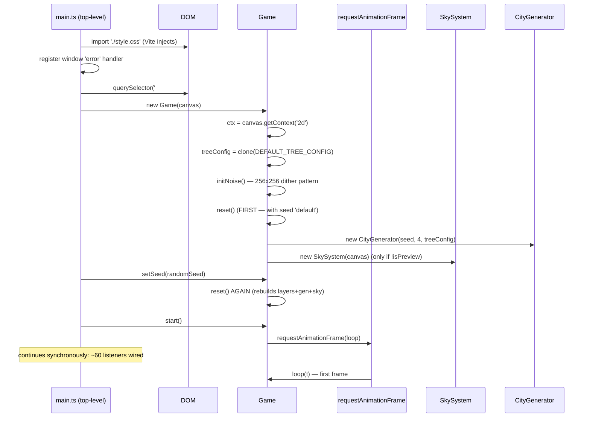
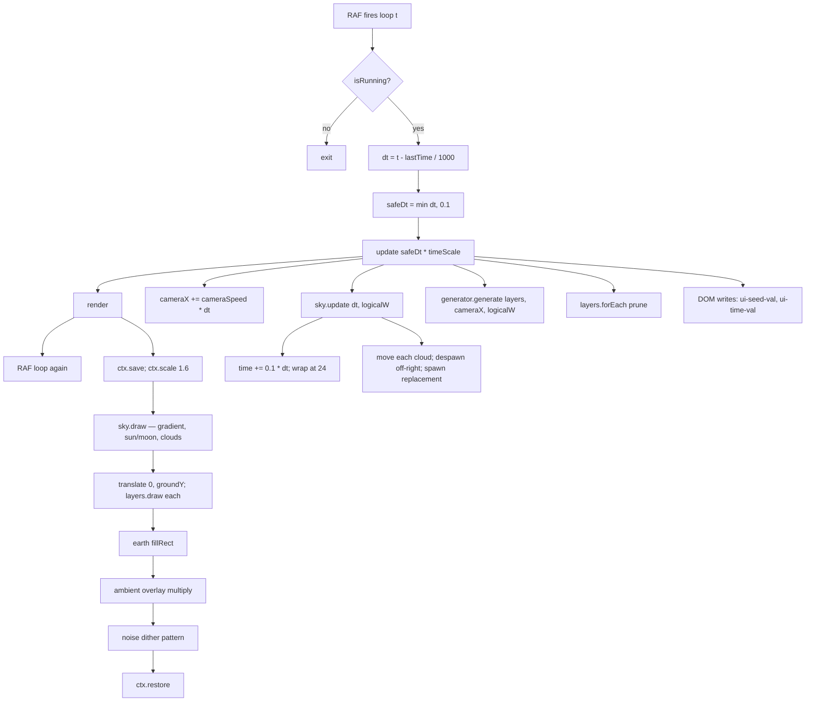
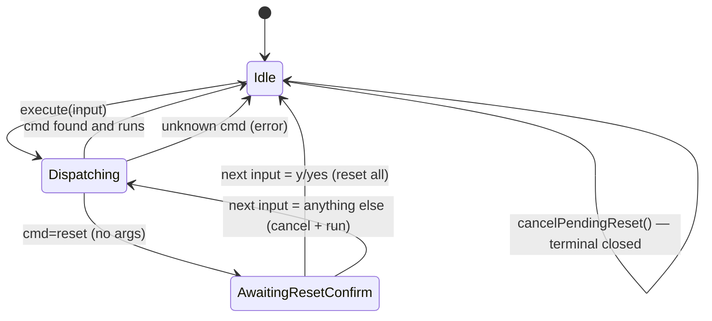
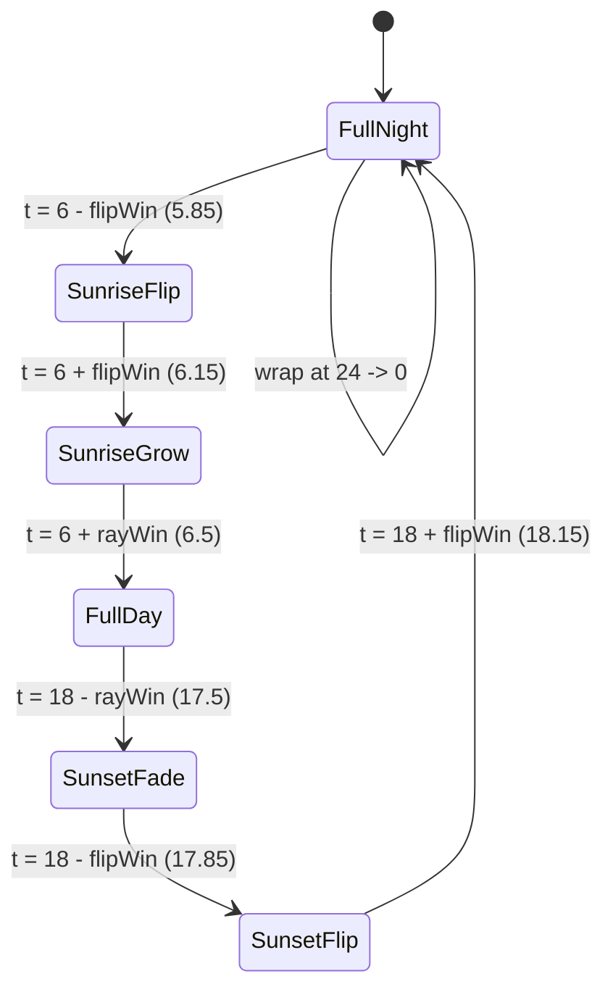
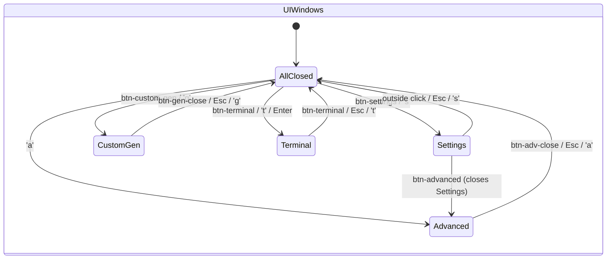
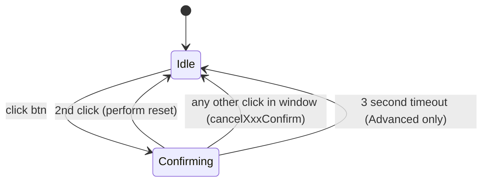

# Control Flow

## Definition

The control-flow concept captures **how a frame happens** in skyline-scroller — from module load through DOM injection, through the RAF tick, into update/render, and back out to event handlers. It also enumerates the **five state machines** that emerged organically: only the Terminal FSM is explicit; the rest are implicit but real.

## Where it lives

| Domain | Anchor |
|---|---|
| Startup | `src/main.ts` (1894 LOC) top-level + `Game` constructor (`src/engine/Game.ts`) |
| Frame loop | `Game.loop / update / render` (`src/engine/Game.ts:146-258`) |
| Terminal grammar | `Terminal.execute / pendingResetTarget` (`src/engine/Terminal.ts:60-71`) |
| Sky FSM | `SkySystem.update / drawCelestialBody` (`src/engine/SkySystem.ts:161-401`) |
| Cloud lifecycle | `SkySystem.update / createCloud` (`SkySystem.ts:47, 141-182`) |
| Modal windows | `main.ts toggleWindow / Escape priority chain` (`main.ts:604-609, 1731-1770`) |
| Two-step confirm | `main.ts btnAdvReset / btnGenReset / Terminal.reset` |

## Why it matters

- The frame tick is the only "real" clock in the engine. Every system polls (no events fire on "frame elapsed", "biome changed", "cloud despawned"). Understanding the polling cadence is required to debug timing leaks (e.g. [[concepts/time]] D4).
- The DOM-state ↔ game-state mirror is bridged exactly once per command via `syncUIFromTerminal`. Without this back-pull, terminal commands would silently desync the UI.
- The Escape priority chain (Terminal → CustomGen → Advanced → Settings → PointerLock → Fullscreen) is the only documented modal-close ordering.

## Startup sequence

Two wrinkles: `reset()` runs **twice** on boot (once in ctor with seed "default", once after `setSeed`). The DOM is fully synchronous innerHTML injection — no `DOMContentLoaded` race because Vite serves the module synchronously.

## Frame tick

Hot costs per frame: 4× layer draw (largely opaque since pixels are cached, see [[concepts/entity-caching]]), 1× sky gradient + ~20 clouds + sun/moon, 1× full-screen multiply overlay, 1× full-screen noise dither.

## State machines

Five FSMs, listed by explicitness.

### SM1 — Terminal grammar (most explicit)

`Terminal.execute()` plus the `pendingResetTarget` field form a real micro-FSM.

### SM2 — SkySystem time-of-day & celestial body

`SkySystem.time` ∈ [0, 24). Several derived phases interpolate between 17 hard-coded keyframes. The celestial body has a phase machine around 06:00 and 18:00:

States control `drawSun` boolean, `currentCore` radius (30↔40), `currentBloom` (0..1), and `scaleX` (cosine flip — see [[concepts/dualisms]] #6).

### SM3 — Cloud lifecycle (per-cloud)

```mermaid
stateDiagram-v2
    [*] --> Drifting: createCloud()
    Drifting --> Drifting: x += speed*dt each tick
    Drifting --> Despawned: cloudMinPixel > logicalW
    Despawned --> [*]: splice; createCloud() pushes new one
```

Constant ~20 clouds maintained. Despawn = "left edge past right edge of screen" (left-to-right wind).

### SM4 — Modal window visibility

`main.ts` treats `.visible` class as the state. Three windows are mutually exclusive in practice (settings/advanced/customGen). Terminal bar uses `style.display='flex'` instead.

**Escape priority chain** (highest first): Terminal → CustomGen → Advanced → Settings → pointerLock → native fullscreen exit. Sequenced `if … return` ladder in `main.ts:1731-1770`.

### SM5 — Two-step confirm buttons

Two near-identical state machines for "Reset Default" (Custom-Gen + Advanced):

Advanced uses a `setTimeout(cancelAdvResetConfirm, 3000)`. Custom-Gen has no timeout, only click-outside-cancel. Note: the Advanced timer handle is **not stored** — it can leak if the user confirms within 3s (benign).

## Counter-examples

- **Polled, not event-driven.** No event fires on "biome changed", "frame elapsed", "cloud despawned". Everything is checked each tick. Listing this as the inverse of explicit FSMs: most of the engine is *implicit* state evolved by polling.
- **Two `btnGenApply` handlers** are registered (`main.ts:698` and `:1369`). Both run on Apply. Refactor remnant.
- **No `removeEventListener` anywhere.** Listeners live for the page lifetime. `previewGame` keeps running its RAF loop after the custom-gen window closes.

## Invariants

- `game.isRunning` is a one-way latch: flipped on `start()`, off only in error or `dispose()`. Pause = `timeScale = 0`, not `isRunning = false`.
- `safeDt = min(dt, 0.1)` — no sim step longer than 100 ms regardless of `timeScale`. A 10× speed run after backgrounding still only catches up 1 second of sim per frame.
- Sky time always in `[0, 24)`. Wrap at 24 → 0 (explicit `if`, not modulo).
- Cloud count is approximately constant at 20.
- Terminal command names are unique; aliases share the `Command` object. `getSuggestions` filters `name === cmd.name.toLowerCase()` to avoid showing aliases as suggestions (#108 in [[concepts/dualisms]]).
- DOM is fully constructed before any handler runs.
- `setSeed` always triggers full `reset()` — even with the same seed (used by `btn-gen-apply` to reload tree config).

## See also

- [[entities/Game]] — engine façade + RAF loop
- [[entities/Terminal]] — command grammar + autocomplete
- [[entities/SkySystem]] — time-of-day FSM + cloud lifecycle
- [[concepts/time]] — three time domains (D4)
- [[concepts/dualisms]] — DOM-state vs game-state (the big tension)
- [[decisions/DEC-04-main-decomposition]] — proposed main.ts split
