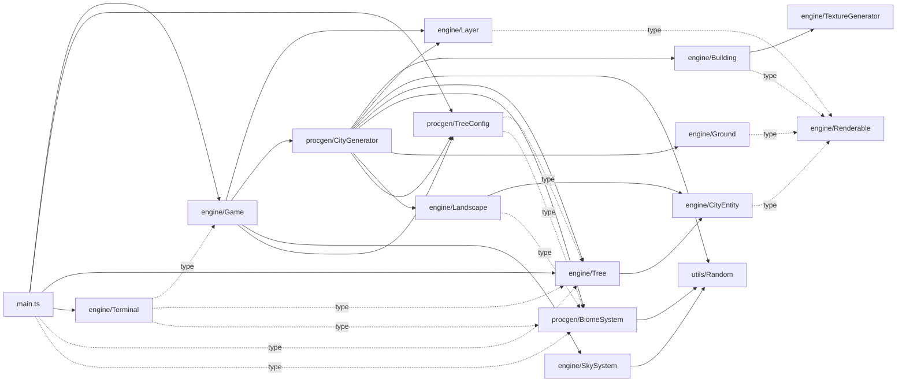

# Module dependency graph

Static `import` graph of every TypeScript file under `src/` + `tests/`. **17 nodes, 37 edges, 0 cycles** (acyclic confirmed by edge walk). Layering: `utils/ ← procgen/ ← engine/ ← main.ts`.

## Mermaid (graph LR)

Dotted edges = `import type` (erased at runtime). See Type only imports as cycle breakers.

## Headline metrics

| Metric | Value |
|---|---:|
| Nodes (modules) | **17** |
| Edges (imports) | **37** |
| Cycles | **0** |
| Type-only edges | **9 / 37** (~24%) |
| Runtime edges | **28 / 37** (~76%) |
| DAG depth (longest value-path) | **4** (`Random → BiomeSystem → CityGenerator → Game → main`) |
| Leaves (0 outbound) | **4** (`Random`, `Renderable`, `TextureGenerator`, `counter`) |

## Inbound ranking — most depended-upon

| Rank | Module | Inbound | Importers |
|---:|---|---:|---|
| 1 | [[entities/Tree]] | **5** | CityGenerator, TreeConfig, Terminal, main, (self-secondary import in main.ts) |
| 1 | [[entities/BiomeSystem]] | **5** | CityGenerator, TreeConfig, Landscape, Terminal, main |
| 3 | [[entities/Renderable]] | 4 | Layer, Building, CityEntity, Ground |
| 3 | [[entities/Random]] | 4 | CityGenerator, BiomeSystem, SkySystem, tests/Random.test |
| 3 | [[entities/TreeConfig]] | 4 | Game (2x: type + value), CityGenerator, main |
| 6 | [[entities/CityEntity]] | 2 | Landscape, Tree |
| 6 | [[entities/Layer]] | 2 | Game, CityGenerator |
| 6 | [[entities/Game]] | 2 | main (value), Terminal (type) |

`Tree` and `BiomeSystem` tie at the top — they are the **vocabulary of the procgen layer**.

## Outbound ranking — most importing

| Rank | Module | Outbound | Comment |
|---:|---|---:|---|
| 1 | [[entities/CityGenerator]] | **8** | Orchestrator — pulls Building, Layer, Random, Tree, BiomeSystem, Ground, Landscape, TreeConfig |
| 2 | `main.ts` (see main entrypoint) | **7** | Bootstrapper — Game, Terminal, TreeConfig, Tree (twice — line 735 re-imports), type pulls |
| 3 | [[entities/Game]] | 5 | Layer, CityGenerator, TreeConfig (type+value as 2 lines), SkySystem |
| 4 | [[entities/Terminal]] | 3 | All type-only: Game, Tree, BiomeSystem |
| 5 | [[entities/TreeConfig]] | 2 | Tree, BiomeSystem (both type) |
| 5 | [[entities/Building]] | 2 | Renderable (type), TextureGenerator |
| 5 | [[entities/Landscape]] | 2 | CityEntity, BiomeSystem (type) |

**CityGenerator is the import sink. main.ts is sink #2.** Together they account for **15 / 37** outbound edges (~40%).

## Type-only vs runtime split

| File | Imports | Type-only | Notes |
|---|---:|---:|---|
| `engine/Terminal.ts` | 3 | **3** | 100% type-only — compiles independently of `Game` |
| `procgen/TreeConfig.ts` | 2 | **2** | 100% type-only — pure data |
| `main.ts` | 7 | 2 | TreeType + BiomeType + AutocompleteSuggestion |
| `engine/Game.ts` | 5 | 1 | TreeConfig type + value on separate lines |
| `engine/Building.ts` | 2 | 1 | Renderable abstract |
| `engine/CityEntity.ts` | 1 | 1 | Renderable abstract |
| `engine/Ground.ts` | 1 | 1 | Renderable abstract |
| `engine/Layer.ts` | 1 | 1 | Renderable abstract |
| `engine/Landscape.ts` | 2 | 1 | BiomeType erased |
| others | — | 0 | runtime-only or leaves |

**4 of 9 type-only edges target `Renderable`** — the abstract contract is the highest-leverage erased dependency. See Type only imports as cycle breakers.

## Cycle audit

Walked every edge. **0 cycles.**

The closest near-cycle is `Terminal -.type.-> Game` while `main.ts` constructs both and wires them via `terminal.bind(game)`. The `Terminal → Game` edge is **type-only** (erased at runtime), so the would-be cycle disappears at compile time. This is the load-bearing reason the engine compiles. See Type only imports as cycle breakers.

## Invariants

- **Acyclic DAG, depth 4.** Longest value-path: `Random → BiomeSystem → CityGenerator → Game → main`.
- **`Renderable` has no implementation imports** — purely a contract. Implementations: `Building`, `CityEntity` (and via inheritance `Tree`, `Landscape`), `Ground`, `Layer`. See [[entities/Renderable]].
- **`Random` is the only PRNG ingress** for procgen. Three runtime consumers (`SkySystem`, `BiomeSystem`, `CityGenerator`) + tests. `Math.random` only appears in `main.ts:235` (initial seed) — though see Determinism for the `Building`/`Landscape`/`SkySystem` stochastic-decoration leak.

## Cross-links

- [[entities/CityGenerator]] — highest outbound fan-out (8); blast-radius hub
- [[entities/Tree]], [[entities/BiomeSystem]] — tied inbound leaders (5 each)
- [[entities/Renderable]] — 4 type-only edges; pure contract
- [[entities/Random]] — single PRNG ingress
- [[systems/procgen]] — runtime consumer chain
- Type only imports as cycle breakers — why `Terminal -.type.-> Game` is fine
- [[maps/complexity]] — sibling map: file-by-file LOC + CC ranking
- Dependency Graph — definition of the graph used here
