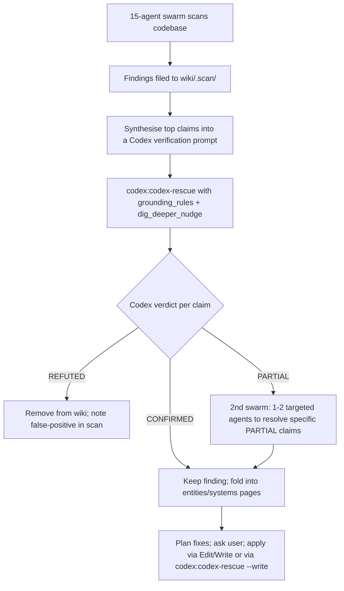

# Codex Integration

This page is the **authoritative reference** for how the main Claude agent in this repo collaborates with OpenAI Codex (GPT-5.3-Codex / GPT-5.4 family). It covers the local plugin contract, the headless CLI surface, and the prompt-construction rules for write- and read-paths.

> [!important]
> **Always file Codex-related notes in this wiki, not in `MEMORY.md`.** This page is the single source of truth.

## TL;DR — the one-call rule

The main Claude agent **never** invokes `codex exec` directly. It always goes through the local plugin's subagent:

```
Agent({
  description: "<5 word desc>",
  subagent_type: "codex:codex-rescue",
  prompt: "<the natural-language task or review request>",
  run_in_background: true   // default for anything non-trivial
})
```

`codex:codex-rescue` is a thin forwarder. It must perform exactly **one** `Bash` call:

```bash
node "${CLAUDE_PLUGIN_ROOT}/scripts/codex-companion.mjs" task [flags] [prompt]
```

…and return Codex's stdout verbatim. Claude-side post-processing is forbidden inside the rescue subagent.

## The three Codex surfaces

| Surface | When to use | How |
|---|---|---|
| `task` | Diagnosis, planning, research, implementation, **independent verification** of swarm findings. | `codex-companion.mjs task ...` via `codex:codex-rescue`. |
| `review` | Reviewing **local git changes** (working-tree or branch vs base). | `codex-companion.mjs review` — built-in review contract; do not hand-roll a `task` prompt for this. |
| `adversarial-review` | Hostile second opinion on changes — focuses on regressions, security, missing tests. | `codex-companion.mjs adversarial-review`. |

Auxiliary: `setup`, `status`, `result`, `cancel`. Setup is invoked via `/codex:setup` if auth is missing.

## Flag reference (companion script)

Forwarded from `codex:codex-rescue` to the companion:

| Flag | Meaning | Default in `codex:codex-rescue` |
|---|---|---|
| `--write` | Allow Codex to edit files (workspace-write sandbox). | **Added by default** unless the user asks for read-only. |
| `--background` | Detach from terminal — Claude polls / receives notification on completion. | Used for open-ended or multi-step work. |
| `--wait` | Inverse of `--background` — block until Codex finishes. | Used for small bounded requests. |
| `--resume-last` | Continue the most recent Codex thread in this repo. | Triggered by user text `continue`/`keep going`/`resume`/`dig deeper`. |
| `--fresh` | Force a new thread even when the request reads like a follow-up. | User-explicit. |
| `--effort <none\|minimal\|low\|medium\|high\|xhigh>` | Reasoning budget. | Unset — Codex picks. |
| `--model <name\|spark>` | Pin a specific Codex model. `spark` → `gpt-5.3-codex-spark`. | Unset — Codex default. |

Underlying `codex exec` flags (relevant when reading Codex output schemas — Claude never builds the command itself):

| Flag | Effect |
|---|---|
| `--json` | Emits JSON-lines event stream on stdout (`thread.started`, `turn.started/completed`, `item.started/completed`, `error`). Includes per-turn token usage. |
| `-o, --output-last-message <path>` | Writes the final agent message to a file. |
| `--output-schema <path>` | Forces final reply to match a JSON Schema. |
| `--sandbox <read-only\|workspace-write\|danger-full-access>` | Permission level. The companion picks based on `--write`. |
| `--ephemeral` | Don't persist session rollout to disk. |
| `--ignore-rules` / `--ignore-user-config` | Skip `.rules` files / `$CODEX_HOME/config.toml`. |
| `--skip-git-repo-check` | Allow run outside a git repo. |

The companion always runs inside a git repo; outside-repo Codex calls are not part of this project's contract.

## How to **WRITE** a Codex prompt — the XML contract

Codex (GPT-5.4 family) expects compact, block-structured prompts with **stable XML tag names**. The local `gpt-5-4-prompting` skill enforces this. Do not write Codex prompts as prose paragraphs — they degrade quality.

### Required block: `<task>`

The concrete job and relevant repository or failure context. One sentence is fine for narrow asks; multiple sentences for context-heavy ones.

### Output contract — exactly ONE of:

- `<structured_output_contract>` — when you want a specific multi-section response (use for review, recommendation, implementation summary).
- `<compact_output_contract>` — when you want a tight 3–5 bullet answer (use for diagnosis).

### Conditional blocks (add only when the task needs them)

| Block | Add when |
|---|---|
| `<default_follow_through_policy>` | You want Codex to keep going by default instead of asking routine questions. |
| `<verification_loop>` | Debugging, implementation, or risky fixes — forces a final self-check. |
| `<completeness_contract>` | Implementation tasks — prevents "identified the issue, stopped without fixing". |
| `<grounding_rules>` | Review or research — forces every claim to be evidence-anchored, with inferences labelled. |
| `<citation_rules>` | Research tasks pulling from web/docs — primary sources required. |
| `<research_mode>` | Recommendation tasks — separate observed facts / inferences / open questions, breadth-first. |
| `<dig_deeper_nudge>` | Review tasks — pushes Codex to check second-order failures, empty states, retries, stale state, rollback. |
| `<missing_context_gating>` | High-stakes tasks — forces Codex to state exactly what it cannot determine instead of guessing. |
| `<action_safety>` | Write-mode tasks — keeps the change scoped, blocks drive-by refactors. |

### Recipe-by-job-type (verbatim from the local skill)

**Diagnosis** — `<task> + <compact_output_contract> + <default_follow_through_policy> + <verification_loop> + <missing_context_gating>`.

**Narrow fix (write-mode)** — `<task> + <structured_output_contract> + <default_follow_through_policy> + <completeness_contract> + <verification_loop> + <action_safety>`.

**Root-cause review (read-mode)** — `<task> + <structured_output_contract> + <grounding_rules> + <dig_deeper_nudge> + <verification_loop>`.

**Research / recommendation** — `<task> + <structured_output_contract> + <research_mode> + <citation_rules>`.

**Prompt patching** — `<task> + <structured_output_contract> + <grounding_rules> + <verification_loop>`.

### Anti-patterns to avoid

- ❌ Vague nudges ("please think hard").
- ❌ Multi-task prompts ("diagnose AND fix AND open a PR"). Split into separate runs.
- ❌ Restating the entire context on a `--resume-last` follow-up. Send the **delta** only.
- ❌ Raising reasoning effort (`--effort xhigh`) before tightening the prompt.
- ❌ Letting Codex auto-apply review findings — **review output never gets fixed automatically**; always confirm with the user first (see `codex-result-handling` skill).

## How to **READ** Codex output

The companion returns rendered markdown by default (or JSON with `--json`). The structure depends on the recipe used:

### Review / adversarial-review output

```
1. Findings (ordered by severity)
   - Each with: severity, file:line, evidence, suggested fix
2. Touched files (if any edits were made)
3. Residual risks
4. Next steps
```

**Critical rule (from `codex-result-handling`):** After presenting review findings, **STOP**. Do not auto-fix. Always ask the user which findings to act on.

### Task output (diagnosis / implementation)

The contract you chose in the prompt determines the shape. For `<compact_output_contract>` expect 3-5 bullets. For `<structured_output_contract>` expect numbered sections matching the contract.

### JSON-lines event stream (`--json`)

When the companion is invoked with `--json` (rare from the main thread, common when wrapping Codex from another script):

| Event type | Meaning |
|---|---|
| `thread.started` | Session initialised, includes session ID. |
| `turn.started` / `turn.completed` | One agent turn. `turn.completed` carries token usage. |
| `item.started` / `item.completed` | Sub-step inside a turn — agent message, reasoning trace, command execution, file change, MCP call. |
| `error` | Processing failure; surfaces stderr context. |

### Preservation rules when relaying Codex output to the user

1. **Preserve verdict order** — findings stay ordered by severity as Codex returned them.
2. **Preserve evidence boundaries** — if Codex labelled something an inference, keep that label. Do not promote inferences to confirmed findings.
3. **Preserve file paths and line numbers exactly.**
4. **Preserve sections the contract asked for** — observed facts, inferences, open questions, touched files, next steps.
5. **If Codex failed or returned nothing, say so explicitly** — do not invent a substitute answer. Direct the user to `/codex:setup` if auth is the cause.
6. **If Codex edited files, list them** — Claude must acknowledge the writes to the user.

## The verification loop used in this repo

Standard pattern for "swarm → Codex → swarm" (the user's preferred validation cycle, per their May 2026 instructions):



**Why this shape:**
- The first swarm parallelises broadly and is fast but noisy.
- Codex provides an independent second opinion grounded in fresh code reads — orthogonal failure modes to Claude.
- The second swarm is narrow and only fires on `PARTIAL` claims, conserving tokens.

## Concrete invocation patterns used in this repo

### Pattern 1 — Verify a list of swarm-found defects

```
Agent({
  description: "Codex verify swarm findings",
  subagent_type: "codex:codex-rescue",
  prompt: """
    Independent verification pass. A 15-agent swarm reported the following defects.
    Read each relevant file and tell me CONFIRMED | REFUTED | PARTIAL with file:line evidence.
    Do NOT trust the swarm's wording.

    1. <Game.dispose() leaks resize handler — alleged file:line>
    2. <CityGenerator + BiomeSystem use identical RNG sequence>
    ...

    For each: one line `N. CLAIM — VERDICT (file:line: quote)`.
    Then 3-5 sentences on overall posture.
    Don't fix anything. Don't write to wiki.
  """,
  run_in_background: true
})
```

(The XML tags are added by the `codex:codex-rescue` forwarder via the `gpt-5-4-prompting` skill — Claude sends natural-language tasks, the wrapper tightens them.)

### Pattern 2 — Apply a narrow fix after user approval

After review + user confirmation:

```
Agent({
  description: "Apply Codex-verified fix",
  subagent_type: "codex:codex-rescue",
  prompt: "Apply the fix for finding #3 (Game.dispose leaks resize handler). Narrow scope only — do not touch anything else. Keep behaviour identical for current callers.",
  // --write is the default for codex:codex-rescue
})
```

### Pattern 3 — Adversarial review of a PR-sized diff

Used before pushing direct-to-main:

```
/codex:adversarial-review
```

…or programmatically:

```
Agent({
  description: "Adversarial review of branch",
  subagent_type: "codex:codex-rescue",
  prompt: "adversarial-review of working tree vs main, focus on regression risk in the Building→CityEntity refactor"
})
```

(The rescue subagent will route `adversarial-review` requests appropriately.)

## Authentication

- Default: Codex CLI's saved auth (`~/.codex/auth.json`).
- CI: `CODEX_API_KEY` environment variable.
- Missing auth → `codex:codex-rescue` returns a setup-required signal — direct the user to `/codex:setup`. Do not improvise an alternate auth flow.

## What Claude must NOT do

These are enforced by the `codex-cli-runtime` and `codex-result-handling` skills:

1. **Do not** call `codex exec` directly from a Bash tool. Always go through `codex:codex-rescue`.
2. **Do not** call `review`, `adversarial-review`, `status`, `result`, or `cancel` from inside `codex:codex-rescue` — only `task`.
3. **Do not** inspect the repo, read files, grep, or otherwise pre-analyse from inside the rescue subagent. It is a forwarder.
4. **Do not** auto-apply Codex review findings without user confirmation.
5. **Do not** invent a substitute answer when Codex fails — report the failure verbatim.
6. **Do not** push `--effort` or `--model` defaults — leave them unset.

## When NOT to use Codex

- Trivial asks the main thread can finish in one or two tool calls.
- Quick lookups (use `Read`, `Grep`, `Bash` directly).
- UI-only changes that require a browser to validate.
- Tasks where the user explicitly asked for Claude-side work.

## Cross-references

- [[operations/build-deploy]] — where the verified fixes ultimately land.
- [[maps/wiki-drift]] — Codex is one of the tools used to confirm legacy-doc claims.
- [[concepts/determinism]] — first big batch of Codex verifications in this repo targeted determinism leaks.

## Sources

- OpenAI Codex docs — [Non-interactive mode (`codex exec`)](https://developers.openai.com/codex/noninteractive)
- OpenAI Codex docs — [Subagents](https://developers.openai.com/codex/subagents)
- Aman Mittal — [Running headless Codex CLI inside Claude Code](https://amanhimself.dev/blog/running-headless-codex-cli-inside-claude-code/)
- Local plugin — `~/.claude/plugins/cache/openai-codex/codex/1.0.4/` (skills: `codex-cli-runtime`, `codex-result-handling`, `gpt-5-4-prompting`; agent: `codex-rescue`; companion: `scripts/codex-companion.mjs`)
- GitHub Blog — [Pick your agent: Claude and Codex on Agent HQ](https://github.blog/news-insights/company-news/pick-your-agent-use-claude-and-codex-on-agent-hq/)
- skills.rest — [using-codex-exec](https://skills.rest/skill/using-codex-exec)
