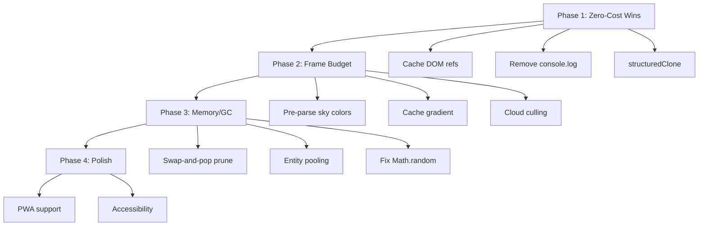

# Optimization Schema

Master optimization plan for **skyline-scroller**, synthesized from 4 deep-dive analyses.

## 🔴 Critical (Do First)

| # | Issue | Domain | File |
|---|-------|--------|------|
| 1 | DOM `getElementById` in game loop | [[architecture-memory]] | `Game.ts:182` |
| 2 | Gradient recreation every frame | [[rendering-performance]] | `SkySystem.ts:194` |
| 3 | Color string parsing per frame | [[rendering-performance]] | `SkySystem.ts:254` |
| 4 | `Math.random()` breaks determinism | [[procedural-generation]] | `Building.ts`, `Landscape.ts` |
| 5 | `JSON.parse(JSON.stringify())` clone | [[architecture-memory]] | `Game.ts:41` |

## 🟡 Medium (Do Next)

| # | Issue | Domain |
|---|-------|--------|
| 6 | `Array.filter()` per frame | [[architecture-memory]] |
| 7 | `splice()` O(n) clouds | [[procedural-generation]] |
| 8 | No entity object pooling | [[procedural-generation]] |
| 9 | Cloud visibility culling | [[rendering-performance]] |
| 10 | Landscape double-draw | [[rendering-performance]] |
| 11 | `forEach` closures in loops | [[architecture-memory]] |
| 12 | `console.log` in production | [[architecture-memory]] |
| 13 | Resize debounce | [[ux-bundle]] |

## 🟢 Low (Polish)

| # | Issue | Domain |
|---|-------|--------|
| 14 | rAF closure per frame | [[rendering-performance]] |
| 15 | PWA support | [[ux-bundle]] |
| 16 | Accessibility | [[ux-bundle]] |

## Implementation Phases

## Detailed Analysis

- [[rendering-performance]]
- [[architecture-memory]]
- [[procedural-generation]]
- [[ux-bundle]]
