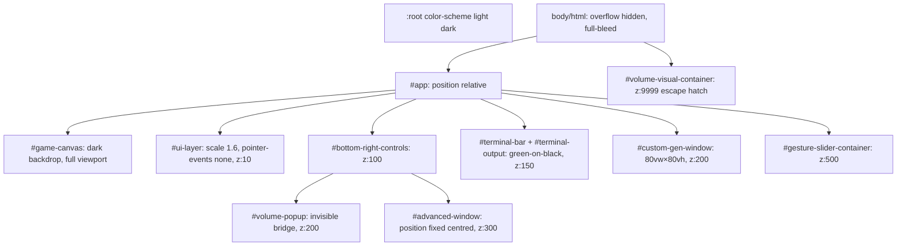
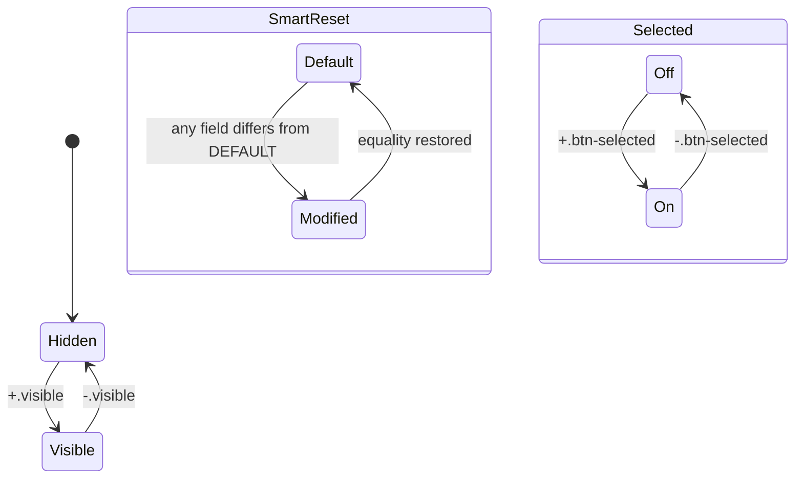

# CSS Architecture — system

## Goal

Style the entire UI ([[systems/ui-shell]]) with a single non-modular stylesheet. Provide visual state machines via class toggles (`.visible`, `.btn-selected`, `.default` / `.modified`), build hand-rolled controls (dual-slider, smart-reset, modals, terminal) where native widgets don't fit, and let `#game-canvas` remain hit-testable beneath an upscaled, click-through HUD.

## Boundary

**In:** `src/style.css` (542 LOC), `index.html` (13 LOC scaffold), `public/vite.svg` (default favicon — not replaced).

**Out:** all DOM nodes are created by [[systems/ui-shell]]'s `innerHTML` template (`main.ts:9-229`) plus runtime injections. Logic and state mutations live in JS; CSS only paints.

## Style topology

## Visibility & state via class toggles

No CSS custom properties / no `:root` tokens beyond `font` and `color-scheme`. Every reusable colour (greens `#2E7D32` / `#4CAF50`, reds `#d32f2f` / `#c62828`, surface `rgba(20,20,20,0.95)`) is repeated literally.

## Z-index ladder (informal)

| Layer | z-index | Element |
|---|---|---|
| HUD | 10 | `#ui-layer` |
| Corner controls | 100 | `#bottom-right-controls` |
| Terminal | 150 | `#terminal-bar`, `#terminal-output-container` |
| Custom-gen / volume popup | 200 | `#custom-gen-window`, `#volume-popup` |
| Advanced | 300 | `#advanced-window` |
| Gesture HUD | 500 | `#gesture-slider-container` |
| Escape hatch | 9999 | `#volume-visual-container` (runtime-injected) |

## Tricks & idioms

- **`pointer-events: none` on `#ui-layer`** — canvas remains hit-testable; children opt back in with `pointer-events: auto`.
- **`transform: scale(1.6)` on `#ui-layer`** — global HUD zoom, hard-coded magic number; distorts hit-areas and pixel-snapping.
- **`#volume-popup` invisible bridge** — wrapper is transparent, `::before` paints the real background; the transparent bottom padding stops the hover gap from closing the popup.
- **Dual-slider widget** — two stacked `<input type="range">` plus `track-bg` + `track-fill`. Thumb-width compensation `calc(${p}% + 8px - ${p*0.16}px)` is empirically tuned (16 px thumb).
- **Vertical volume slider** uses deprecated `writing-mode: bt-lr` and `-webkit-appearance: slider-vertical` — likely broken on modern Chromium.
- **Smart-reset button** encodes a two-state machine in CSS: `.default` (yellow, `cursor: default`, cosmetic) vs `.modified` (red, `cursor: pointer`, actionable). See default vs modified.
- **`!important` usage** on `.tree-setting-wrapper:hover`, `.terminal-copied`, `.btn-selected` — indicates inline-style fights with JS-set backgrounds.

## Failure modes / edge cases

- **Duplicate selectors for `#settings-window` / `#advanced-window`** (lines 115-134 vs 136-152) — the second block clobbers `border-radius: 8px → 12px` and `padding: 10px → 20px`. Cascade order saves it; refactor opportunity.
- **`writing-mode: bt-lr`** is invalid CSS3 (was draft); modern browsers ignore. Vertical volume slider degrades.
- **Hard-coded `right: 180px` on `#terminal-bar`** assumes exact width of bottom-right controls. One added button breaks the layout.
- **No media queries** — desktop-only layout despite `viewport` meta tag.
- **No `prefers-reduced-motion`** branch — all transitions unconditional.
- **No `:focus-visible` / `outline: none` on `#terminal-input`** — keyboard-only users lose focus indication. No `aria-label`, no `role="dialog"` on modals.
- **`color-scheme: light dark`** declared but only dark palette implemented — aspirational not implemented.
- **`#volume-visual-container` z:9999** — escape hatch; typical "I lost the z-index war" smell.
- **No favicon for the actual app** — `public/vite.svg` is the unmodified Vite logo.
- **`index.html` is essentially empty** — no `<noscript>`, no SEO content, no server-rendered fallback. Entire UI lives in JS-built `innerHTML`.
- **Mixed units** — `px`, `vw/vh`, `%` mixed in the same component (`#custom-gen-window` uses `80vw/80vh` while parent `.ui-window` has fixed padding).
- **`cursor: default` on `.btn-smart-reset.default`** — a "button" that visually says "not clickable". Communicates state nicely but breaks the affordance.

## Invariants

- Every modal has a `.visible` toggle; without it, all are hidden.
- `body/html` always full-bleed, no scroll.
- `#ui-layer` always upscaled 1.6× and pointer-events:none (children opt back in).
- Terminal colour always `#0f0` on `rgba(0,0,0,0.85)` (phosphor green).
- `#volume-visual-container` z:9999 is the highest in the sheet.
- `#gen-preview-container` forced to 16:9 via `aspect-ratio`.

## Cross-references

- Entities: Settings Window, Advanced Window, Custom Gen Window, Terminal Bar, Volume Popup, Dual Slider, Smart Reset Button
- Concepts: default vs modified, modified indicator, pointer events layering, z index ladder, visibility toggle class, css magic numbers, accessibility gaps, design tokens
- Decisions: no design tokens, inline html template, [[decisions/DEC-04-main-decomposition]]
- Systems: [[systems/ui-shell]] (constructs the DOM and toggles classes)
