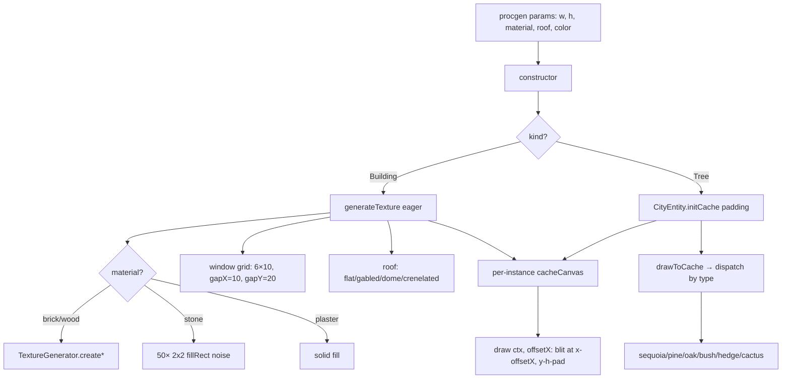

# Entity Rendering — system

## Goal

Turn procgen parameters (material, roof, biome, height, tree type, flower) into pre-baked offscreen canvases that the per-frame draw step can blit cheaply via `drawImage`. Each entity owns its own cache; no global memoisation. Material textures (brick / wood) go through [[entities/TextureGenerator]]; foliage uses inline solid fills.

## Boundary

**In:** [[entities/CityEntity]] (abstract base, 65 LOC), [[entities/Building]] (127 LOC), [[entities/Tree]] (187 LOC, six variants), [[entities/TextureGenerator]] (46 LOC, static-only), `Renderable.ts` (8 LOC interface).

**Out:** [[entities/Ground]] and [[entities/Landscape]] also implement `Renderable` but are covered in [[systems/parallax-layers]] (they're layer infrastructure, not "city entities"). Layer composition and culling: [[systems/parallax-layers]]. Picking which entity to construct: [[systems/procgen]].

## Data flow

## Control flow

**Build phase** (once per entity, at construction):

- `Building` directly calls `generateTexture()` → canvas of `w × (h + 30)` with body + windows + roof. **Does not extend [[entities/CityEntity]]**.
- `Tree` calls `super(x, w, h)` (sets `y=0`), then `initCache(padding)` which allocates `(w + 2p) × (h + 2p)`, translates `(p, p)`, then virtual-dispatches `drawToCache(ctx)` → one of six private `draw<Variant>` methods.

**Draw phase** (per frame, called by [[entities/Layer]] `draw`):

- `screenX = x - offsetX`.
- `Building.draw` blits at `(screenX, y - cacheCanvas.height)`.
- `CityEntity.draw` recovers padding from `(cacheCanvas.width - this.width) / 2` (symmetric padding assumed), blits at `(screenX - padding, y - height - padding)`.

## Tree variant catalog

| Type | Width | Padding | Palette | Notes |
|---|---|---|---|---|
| sequoia | 70 | 0 | dark green | 8 ellipse layers; bottom layer reaches 1.2× width (clips cache) |
| pine | 60 | 0 | conifer dark green | 4 multi-vertex triangle polygons |
| oak | 90 | 30 | bright deciduous | 5 circle puffs; only Tree variant with padding |
| bush | 40 | 0 | bright green | half-arc blobs |
| hedge | 60 | 0 | conifer green | `ctx.roundRect` (Chrome 99+) |
| cactus | 40 | 0 | desert green | only variant with `hasFlower` (`flowerChance` roll), `flowerPos ∈ {left, right}` |

## Failure modes / edge cases

- **No texture memoisation** — N buildings with identical params allocate N canvases. Allocation pressure under dense scenes. Each brick/wood build also creates an intermediate canvas inside [[entities/TextureGenerator]], immediately discarded. See baked canvas caching.
- **`Math.random()` everywhere** — windows lit/unlit, stone noise, wood grain jitter, cactus flower position. None seeded. Breaks [[concepts/determinism]] regardless of `Game.seed`. See [[decisions/DEC-01-unified-rng]].
- **Single coin flip determines all window colours per building** (`#FDF5E6` warm vs `#87CEEB` sky-blue reflection). All windows in one building share state — never mixed.
- **`Building.isVisible()` always returns `true`** — culling silently disabled. Every building draws every frame regardless of viewport. Layer's inline bounds check still skips it, but any caller relying on `isVisible` gets false positives.
- **`Building` does NOT extend `CityEntity`** — half-realised hierarchy. Refactor candidate. See dualism urban vs natural.
- **`Tree.drawCactus` `flowerPos === 'top'` branch is unreachable** — constructor only ever sets `left`/`right` when `hasFlower`; `top` is the dead default.
- **Padding recovery in `CityEntity.draw`** assumes symmetric padding — any future asymmetric subclass breaks the offset.
- **Narrow buildings (width ≤ 20) render zero windows** — `for (wx=10; wx < width - 10; wx+=gapX)` has empty range.
- **Roof height fixed at 30 px** — tiny buildings get a roof 1.5× their body height.
- **Sequoia bottom layer width can reach 1.2× `this.width`** — clips outside cache canvas (no padding for sequoia).
- **`ctx.roundRect` in `drawHedge`** requires Chrome 99+ / Safari 16+; no fallback.

## Invariants

- `y === 0` after construction (set by both base and `Building`); presumably mutated later by a layer/ground placer.
- `Building.cacheCanvas.height === height + 30` (roof headroom hard-coded).
- For Tree: `cacheCanvas.width - width === cacheCanvas.height - height === 2*padding` (symmetric).
- Window grid: `winW=6, winH=10, gapX=10, gapY=20`, margin 10/20 px.
- `Tree.hasFlower === true` implies `type === 'cactus'` AND `flowerPos ∈ {left, right}`.

## Cross-references

- Entities: [[entities/CityEntity]], [[entities/Building]], [[entities/Tree]], [[entities/TextureGenerator]], [[entities/Ground]], [[entities/Landscape]]
- Concepts: renderable contract, baked canvas caching, template method drawToCache, dualism urban vs natural, deterministic vs stochastic decoration, [[concepts/determinism]]
- Decisions: [[decisions/DEC-01-unified-rng]] (all Math.random sites), inheritance asymmetry building vs tree
- Systems: [[systems/parallax-layers]] (Layer drives draw), [[systems/procgen]] (CityGenerator constructs them)
