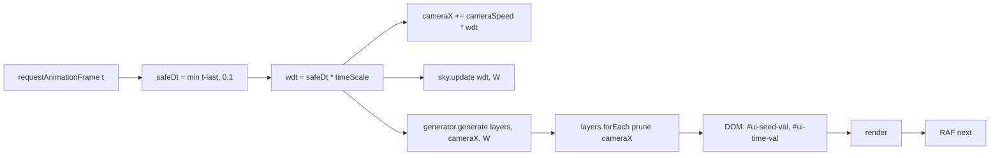
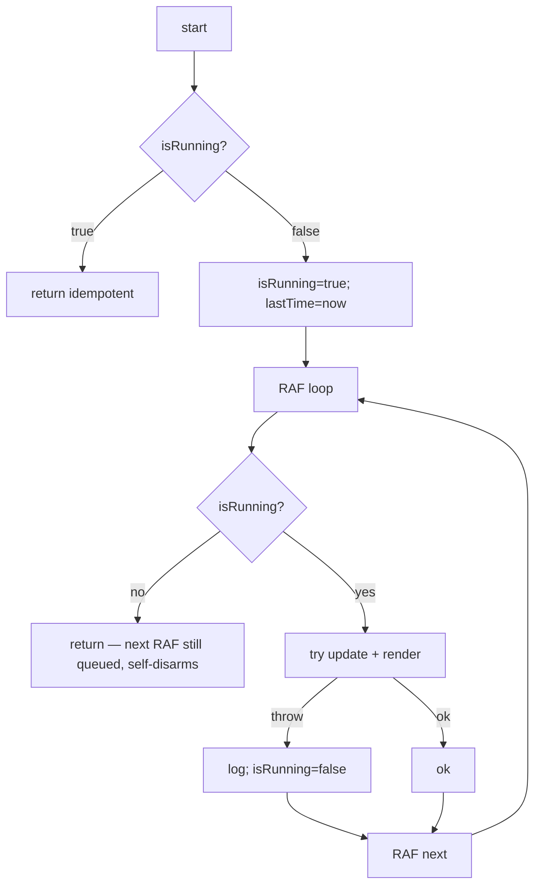

# Game Loop — system

## Goal

Drive one canvas frame at a time: advance world state by `dt` seconds, then render the full Z-stack. Self-terminate on error; survive tab-blur stalls without teleporting; expose live read/write hooks (camera, seed, timeScale, treeConfig) so the [[systems/terminal]] and [[systems/ui-shell]] can mutate the world between ticks.

## Boundary

**In:** [[entities/Game]] (the loop coordinator) and the renderable contract (`Renderable.ts`, 8 LOC). `Game.update` and `Game.render` are the canonical tick body.

**Out:** the four [[entities/Layer]] instances and the [[entities/CityGenerator]] are *driven* but not *owned* by this system — they belong to [[systems/parallax-layers]] and [[systems/procgen]]. Sky time advancement is in [[systems/sky]]. Terminal command dispatch is in [[systems/terminal]].

## Data flow

Inputs: real `performance.now()` deltas, `timeScale`, current `seed`, `treeConfig` (mutable by reference). Outputs: mutated `cameraX`, mutated `Layer.objects[]`, two DOM `textContent` writes, full canvas repaint.

## Control flow

**Render Z-order** (canonical, render pipeline order):

1. `ctx.scale(1.6, 1.6)` — global pixel-art zoom (scale factor).
2. `sky.draw` → vertical gradient + sun/moon + clouds.
3. `translate(0, groundY)` then back-to-front `layer.draw` ×4.
4. Solid earth bar (`#2e2e2e`, 80 px) below `groundY`.
5. `globalCompositeOperation = 'multiply'` + `sky.getAmbientColor()` fill (ambient lighting).
6. Noise dither pattern fill (dither noise overlay).

Stack discipline: 2 `save` / 2 `restore`, composite reset to `source-over` before exit.

## Failure modes / edge cases

- **Tab blur / long stall** → `safeDt = min(dt, 0.1)`. World *skips* missing time rather than catching up. Sky time and biome ticks fall behind real seconds.
- **Thrown error in `update` or `render`** → `isRunning=false`, loop self-terminates. No retry, no surfacing to UI (main.ts has a separate `window.error` handler that `alert()`s — see [[systems/ui-shell]]).
- **`dispose()` does not `removeEventListener('resize')`** — the bound arrow keeps a strong reference to `Game`. Real leak on re-instantiation. See [[decisions/DEC-02-lifecycle]].
- **`dispose()` does not `cancelAnimationFrame`** — one extra `loop(time)` fires after dispose, then early-returns on `!isRunning`. Benign but reads as a bug.
- **Negative `timeScale`** is uncapped and would scroll the camera backwards, breaking `Layer.prune` (which assumes monotonic `cameraX`) and `CityGenerator.lastX` (also monotonic).
- **Missing DOM ids** (`#ui-seed-val`, `#ui-time-val`) → `getElementById` returns null, the per-frame writes silently no-op. `isPreview=true` skips this branch entirely.
- **Noise pattern uses `Math.random()`** at construction — unseeded, breaks pixel-identical determinism. See [[concepts/determinism]].

## Invariants

- `0 ≤ safeDt ≤ 0.1` per tick.
- `cameraX` monotonically non-decreasing while `timeScale ≥ 0`.
- `layers.length === 4` after every `reset()` (magic constant passed to [[entities/CityGenerator]]).
- After `render()`: `globalCompositeOperation === 'source-over'`, transform stack balanced.
- `sky === null` iff `isPreview === true`.
- `start()` is idempotent on `isRunning`.

## Cross-references

- Entities: [[entities/Game]], [[entities/SkySystem]], [[entities/CityGenerator]], [[entities/Layer]], [[entities/Random]]
- Concepts: renderable contract, render pipeline order, scale factor, time model, ambient lighting, dither noise overlay, preview mode, [[concepts/determinism]], update render split
- Decisions: [[decisions/DEC-02-lifecycle]] (dispose hygiene), [[decisions/DEC-01-unified-rng]] (noise should be seeded)
- Systems: [[systems/parallax-layers]], [[systems/procgen]], [[systems/sky]], [[systems/terminal]], [[systems/ui-shell]]
