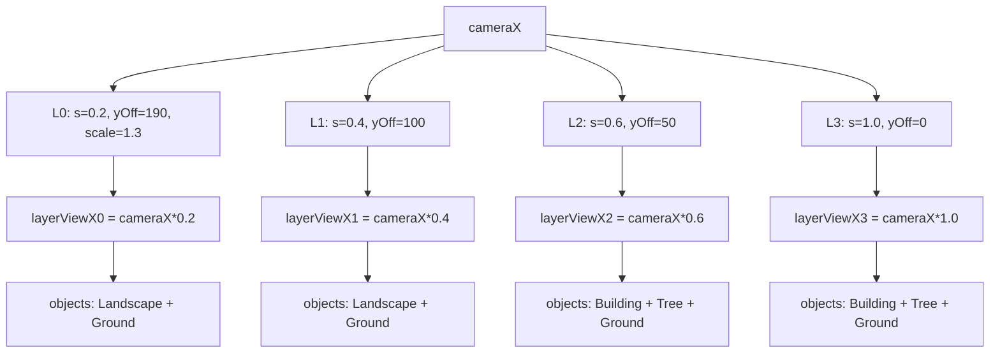

# Parallax Layers — system

## Goal

Give the scroller infinite-horizon depth by drawing four [[entities/Layer]] instances at different speeds, lifts, and scales. Each layer is its own frame of reference: `layerViewX = cameraX × speedModifier`. Slow layers feel far, fast layers feel near. No wrap; chunks are appended ahead of the camera and pruned behind it.

## Boundary

**In:** [[entities/Layer]] (container, 75 LOC), [[entities/Landscape]] (biome silhouette, 175 LOC), [[entities/Ground]] (flat strip, 55 LOC). Layer configuration lives in `Game.reset()`.

**Out:** the renderable contract interface is shared with [[systems/entity-rendering]] (Building, Tree). Chunk emission is owned by [[systems/procgen]]. The earth-bar + ambient overlay are part of [[systems/game-loop]] render pipeline, not Layer itself.

## Data flow



Per-frame per-layer:

```
layerViewX = cameraX * speedModifier
ctx.save(); translate(0, -yOffset); if scale!=1 ctx.scale(s,s)
for obj in objects:
   screenX = obj.x - layerViewX
   if visible: obj.draw(ctx, layerViewX)
ctx.restore()
```

Same `layerViewX` passed as `offsetX` to children — they compute their own screen position.

## Control flow

Generation horizon (driven by [[entities/CityGenerator]]):

```
For each layer i:
   while lastX[i] < cameraX * s_i + viewportWidth + 500:
       addChunk(layer_i)
```

Chunks overlap by 1 px (`lastX[i] += chunkWidth - 1`) to hide ground seams. Pruning drops objects whose right edge sits `> 2000 px` behind `layerViewX` ([[entities/Layer]] `prune(cameraX, buffer=2000)`).

**Layer assignments** (hardcoded in `Game.reset`):

| L | speed | yOffset | scale | Content |
|---|---|---|---|---|
| 0 | 0.2 | 190 | 1.3 | Landscape silhouettes (slowest, biggest, highest) |
| 1 | 0.4 | 100 | 1.0 | Landscape silhouettes |
| 2 | 0.6 | 50 | 1.0 | Building + Tree + Ground |
| 3 | 1.0 | 0 | 1.0 | Building + Tree + Ground (foreground) |

`Landscape.draw` does a **double paint**: cached silhouette polygon + a 2000 px-tall fill rect downward in the biome colour ("fix floating artifacts" — closes gaps between the silhouette baseline and whatever sits below when `yOffset` lifts the layer).

`Ground.isVisible` always returns `true` — culling is delegated to `Layer.draw`'s inline screen-bounds check.

## Failure modes / edge cases

- **`Math.random()` in `Landscape.generateShape` and `Landscape.decorate`** — bypasses seeded [[entities/Random]]. Same seed produces different hills across loads. See [[decisions/DEC-01-unified-rng]].
- **City biome silhouette** uses `Math.random()` for step heights — skyline strip is non-reproducible.
- **`Layer.zIndex` is stored but unused inside `Layer`** — draw order = array order, enforced by the loop in `Game.render`, not by Layer itself.
- **`Layer.draw` does not reset `globalAlpha` / composite ops** — children leak ctx state if they mutate without restoring.
- **Unbounded growth if `prune` is never called** — `Game.update` calls `layers.forEach(l => l.prune(cameraX))`, so this is guarded; verify on any refactor.
- **`Ground` water `y+5` recess** leaves 5 px of background showing at the top of water strips. If `yOffset` doesn't align, sky colour bleeds through the seam.
- **Tundra decoration mismatch** — `Landscape.decorate` interpolates props on a single-peak triangle assumption (`peakRatio = 0.5`). Tundra has 4 peak points; decorations don't sit on the actual curve. Acknowledged in comments.

## Invariants

- `Layer.objects` insertion order ≈ X-ascending (because [[entities/CityGenerator]] walks `lastX[i]` strictly forward).
- `Landscape.points[0].x === 0 && points[last].x === width` — polyline spans full local width.
- `Ground.y === 0`, `Ground.height === 100` — never mutated.
- All `speedModifier ∈ (0, 1]` — no inverted parallax.
- `cacheCanvas` padding for [[entities/Landscape]] = 50 px each side.
- 1 px chunk overlap matches `Landscape.draw`'s `screenX - 1, width + 2` overlap.

## Cross-references

- Entities: [[entities/Layer]], [[entities/Landscape]], [[entities/Ground]], [[entities/CityEntity]], [[entities/CityGenerator]], [[entities/Game]]
- Concepts: parallax scrolling, chunk generation, layer composition, renderable contract, biome system
- Decisions: [[decisions/DEC-01-unified-rng]] (Landscape uses Math.random)
- Systems: [[systems/procgen]] (chunk emitter), [[systems/entity-rendering]] (Building/Tree), [[systems/game-loop]] (drives update + render)
