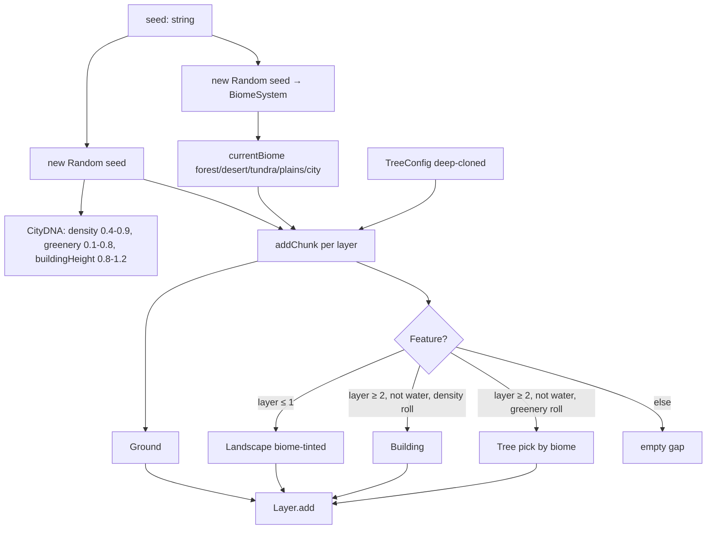
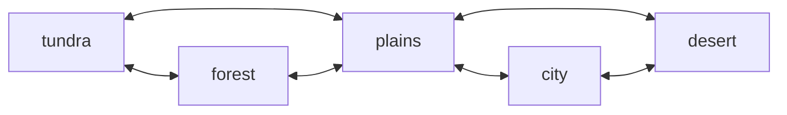

# Procgen — system

## Goal

Emit an infinite, deterministic-from-seed stream of [[entities/Ground]], [[entities/Building]], [[entities/Tree]] and [[entities/Landscape]] objects into the four parallax layers. Each layer's content is determined by (a) the current biome (palette/species), (b) the city DNA (density/greenery/buildingHeight), and (c) the layer index (background = landscape, foreground = buildings + trees).

## Boundary

**In:** [[entities/CityGenerator]] (233 LOC, the pipeline), [[entities/BiomeSystem]] (51 LOC, the climate FSM), [[entities/TreeConfig]] / `DEFAULT_TREE_CONFIG` (68 LOC, the species schema), [[entities/Random]] (Mulberry32).

**Out:** the rendered output (`Building.generateTexture`, `Landscape.drawToCache`, `Tree.drawToCache`) belongs to [[systems/entity-rendering]]. Layer geometry / drawing belongs to [[systems/parallax-layers]]. Sky tint *consumes* `BiomeType` but lives in [[systems/sky]].

## Data flow



Per frame (called from [[systems/game-loop]]):

1. `biomeSystem.update(1)` — ticks `durationRemaining -= 1` (frame-counted, **not** pixel-accurate; see Failure modes).
2. For each layer i: while `lastX[i] < cameraX * s_i + W + 500`, `addChunk(layer_i, i, currentBiome)`.

## Control flow — `addChunk` decision tree

```mermaid
flowchart TD
  S[addChunk i, biome] --> G{layer i?}
  G -->|3 foreground| FG[roll: 0.6 pavement, 0.2 grass, 0.2 water]
  G -->|0,1,2 background| BG[map biome: desert→dirt, forest→grass, city→pavement, else→dirt]
  FG --> F{feature?}
  BG --> F
  F -->|i ≤ 1| LS[Landscape w=200-500, h=100-300, biome]
  F -->|i ≥ 2 + ground=water| NUL[obj=null; width ≥ 100]
  F -->|i ≥ 2 + density roll| BLD[Building biome-tinted]
  F -->|i ≥ 2 + greenery roll| TR[pickTreeType uniform from enabled species in biome]
  F -->|else| GAP[empty 20-100 px gap]
  LS --> COMMIT
  BLD --> COMMIT
  TR --> COMMIT
  NUL --> COMMIT
  GAP --> COMMIT
  COMMIT[Layer.add Ground + maybe feature; lastX[i] += chunkWidth - 1]
```

**Biome adjacency graph** (hand-authored climate gradient):



No direct `tundra ↔ desert/city` edge — must transit via forest/plains. `plains` is the only 3-degree hub.

## Failure modes / edge cases

- **`BiomeSystem.update(1)` hard-coded `dx=1`** — duration `[3000, 8000)` is in *frames*, not pixels. ~50-130 s per biome at 60 fps. Naming says "pixels", behaviour says "frames". See [[decisions/frame-counted-biome-duration]].
- **`CityGenerator` and `BiomeSystem` share the same seed but not the same stream** — Mulberry32 cloned, not forked. Cheap and works; deterministic, but no sub-stream isolation. See [[decisions/DEC-01-unified-rng]].
- **`Landscape.generateShape` uses `Math.random()`** — leaks determinism for hill silhouettes despite seeded generator.
- **`flowerChance` is generic in schema but cactus-only in defaults** — terminal autocomplete advertises it for every species; setting it on pine silently stores but never renders. See [[concepts/tree-config]].
- **`currentTreeConfig` module singleton is dead state** — never read; `CityGenerator.config` is the live copy. Three copies in flight: `DEFAULT_TREE_CONFIG` (const), `currentTreeConfig` (orphan), `generator.config` (used).
- **RNG draws are positional and entangled** — water override (`obj = null`) happens *after* material/roof/color/height rolls were consumed. A "skip rolls if water" optimization would silently change all seeds.
- **`pickTreeType` enumerates via `Object.keys(config)`** — relies on JS key insertion order (spec-safe for string keys). Reordering `DEFAULT_TREE_CONFIG` re-aligns the uniform pick → seeds diverge.
- **`forceBiome` doesn't reseed** — palette flips immediately but RNG state continues, so replays via forces are deterministic given the same force sequence, not relative to a no-forces run.
- **Layer 3 ignores biome for ground type** — pure RNG. The one place urban-vs-natural breaks.
- **No "shore" type** — desert maps to `dirt` (placeholder). Inline comments name this TODO.

## Invariants

- `lastX[i]` monotonically non-decreasing per layer.
- Each chunk emits exactly one [[entities/Ground]]; zero or one feature.
- Water chunk never carries a feature; `featureWidth ≥ 100` on water.
- `Landscape` only on layers 0-1; `Building`/`Tree` only on layers 2-3.
- Tree chunks get 10-30 px breathing room past the tree's own width.
- Config is deep-cloned at construction — mutating `DEFAULT_TREE_CONFIG` later has no effect.
- Same seed + same config + identical calling pattern → byte-identical output.

## Cross-references

- Entities: [[entities/CityGenerator]], [[entities/BiomeSystem]], [[entities/TreeConfig]], [[entities/Random]], [[entities/Building]], [[entities/Tree]], [[entities/Ground]], [[entities/Landscape]], [[entities/Layer]], [[entities/Game]]
- Concepts: [[concepts/chunk-generation]], [[concepts/city-dna]], [[concepts/biome-system]], [[concepts/biome-transition-graph]], [[concepts/determinism]], [[concepts/tree-config]], [[concepts/procgen-pipeline]]
- Decisions: [[decisions/DEC-01-unified-rng]], [[decisions/frame-counted-biome-duration]], [[decisions/dirt-as-shore-placeholder]], [[decisions/DEC-05-low-code-config]]
- Systems: [[systems/parallax-layers]], [[systems/entity-rendering]], [[systems/sky]] (biome tint consumer), [[systems/terminal]] (`generate` writes `config`)
