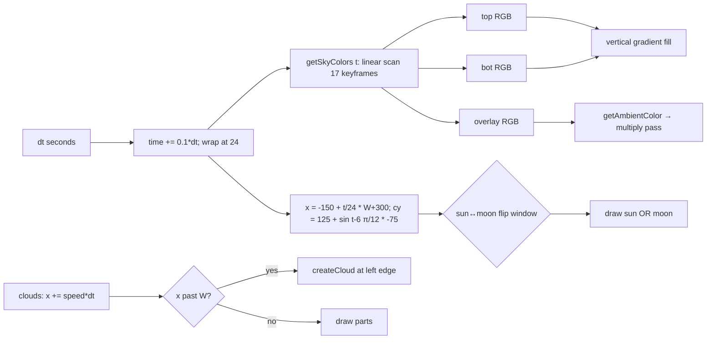
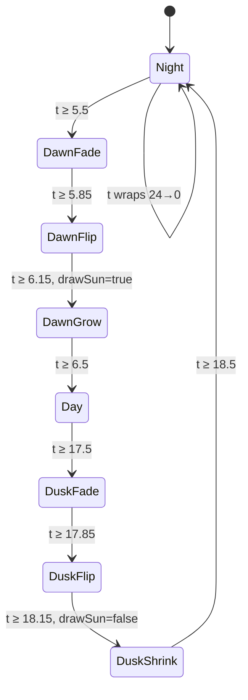

# Sky — system

## Goal

Drive a continuous in-world clock `time ∈ [0, 24)`, render a vertical sky gradient by linear keyframe interpolation, place one celestial body (sun or moon) on a sinusoidal arc, animate ~20 clouds drifting right with despawn-and-recycle, and publish an `overlay` colour that other systems multiply onto the rest of the scene as the ambient tint.

## Boundary

**In:** [[entities/SkySystem]] (402 LOC, single class). Owns `time`, `keyframes[]`, `clouds[]`, an internal [[entities/Random]] (seeded from `Date.now()`).

**Out:** the ambient multiply pass itself is in `Game.render()` ([[systems/game-loop]]); `SkySystem` only *publishes* the colour via `getAmbientColor()`. The HUD clock formatting (`24h | 12h | score`) lives in [[systems/ui-shell]] and `Game.update`'s DOM write. Cloud rendering does not interact with [[systems/parallax-layers]] — clouds live in their own X-space.

## Data flow

## Control flow — sun↔moon FSM

- **Flip window** = 0.3 hours wide; `scaleX = cos(p·π)` then `Math.abs` collapses mirror → squash. Body shrinks to zero width at midpoint, expands as the other body.
- **Bloom** (halo) only exists for the sun. Growth p∈[0,1] at dawn, fade 1→0 at dusk. Core shrinks 40→30 at dusk.
- **Position is symmetric** for sun and moon: same `(x, cy)` formula. At night `sin((t-6)·π/12) < 0` so cy > 125 → moon drifts subterranean. Whether visible depends on viewport height.

## Failure modes / edge cases

- **`Date.now()` seed in constructor** — clouds and start hour are non-reproducible across page loads. Breaks [[concepts/determinism]] even when `Game.seed` is fixed. Worse than [[entities/Landscape]]'s `Math.random()` because it's the *engine's own RNG* opting out. See [[decisions/DEC-01-unified-rng]].
- **`time` wrap discards sub-tick remainder** (`if (time >= 24) time = 0` instead of `time -= 24`). Invisible at current speed but conceptually wrong.
- **Moon arc dips below "horizon"** (`cy > 125` at night). Either intentional aesthetic or unhandled celestial mechanics.
- **`lerpColor` re-parses hex strings every call** — 6+ string allocations per frame from sky alone. Easy memoisation win.
- **Stratus rect anchoring confusion** in inline comments — runtime is correct (corner-origin matches draw call) but the comment block contradicts itself.
- **Per-part cirrus `opacity` is dead data** — draw loop hardcodes `rgba(255,255,255,0.4)`.
- **`approxWidth = 1920` magic** for initial cloud distribution — non-1920 viewports get a mis-spread initial field.
- **`drawSun` initialised with strict `>` and `<`** — at exactly `t === 6.0` or `t === 18.0`, sun won't draw. One-frame flicker.
- **RGB-linear lerp** (no HSL/OKLab) explains why dusk needs 5 keyframes in 1.15 hours — manually pre-shaping what perceptual space would do for free.

## Invariants

- `0 ≤ time < 24` after every `update`.
- Keyframe list ascending by `t`; `t[0] === 0 && t[last] === 24`; `colors[0] === colors[last]` (wrap continuity).
- Exactly one celestial body drawn per frame (sun XOR moon).
- Cloud count constant: every despawn paired with immediate `createCloud(false)`.
- `cloud.x` monotonically increasing per cloud lifetime.
- `lerpColor` always returns `rgb(r,g,b)` (never hex).
- At midday `overlay ≈ rgb(255,255,255)` (neutral multiplier); at deep night `overlay ≈ rgb(15,15,40)` (heavy darken).

## Cross-references

- Entities: [[entities/SkySystem]], [[entities/Game]], [[entities/Random]], [[entities/BiomeSystem]] (`BiomeType` imported here for biome→sky tint, but the wiring is in SkySystem not CityGenerator)
- Concepts: time of day, ambient lighting, color interpolation, celestial body, sun moon flip, [[concepts/determinism]]
- Decisions: [[decisions/DEC-01-unified-rng]] (Date.now seed), [[decisions/DEC-03-safe-eval-and-error]]
- Systems: [[systems/game-loop]] (drives `update`, consumes `getAmbientColor`), [[systems/ui-shell]] (HUD clock formats `getTime()`)
