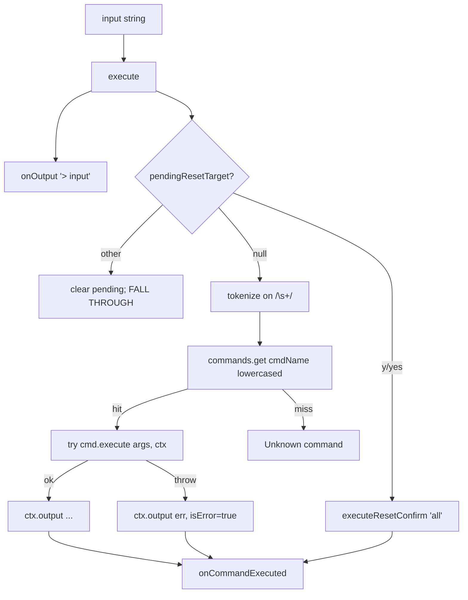
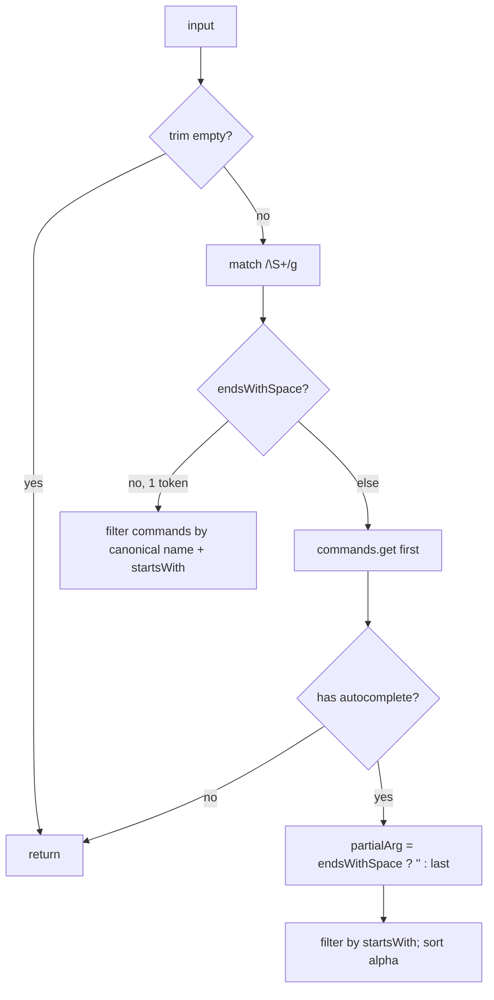

# Terminal — system

## Goal

Provide an in-game DSL for live-tweaking [[entities/Game]] state: seed, speed, volume, mute, time format, tree config, biome readout, fullscreen, reset. Decoupled from rendering — [[entities/Terminal]] emits strings via callbacks; the host ([[systems/ui-shell]]) draws them. Autocomplete is context-aware: `generate <type>` branches on argv depth to offer either tree types or `key:value` hints.

## Boundary

**In:** [[entities/Terminal]] (596 LOC, single file). Owns the `commands: Map<string, Command>` registry (double-indexed: name + each alias → same Command), and `pendingResetTarget` (the only stateful bit). Includes the 12 built-in command records.

**Out:** input event handling (Tab/Space/Enter/ArrowUp/Down/Escape), suggestion list rendering, scrollback DOM, focus management — all in [[systems/ui-shell]]. Terminal calls `onOutput(msg, isError)`, `onClear()`, `onCommandExecuted()`; host paints.

The only DOM API Terminal itself touches is the Fullscreen API (`document.documentElement.requestFullscreen`, `exitFullscreen`).

## Data flow

`getSuggestions(input)`:

## Control flow — command grammar

| Canonical | Aliases | Behaviour |
|---|---|---|
| `help` `?` `h` | list / inspect |
| `seed` `s` | read or write `Game.setSeed` (full reset) |
| `speed` `spd` | `Function(...)` arithmetic eval with `Math.*` in scope, clamp to `[-10000, 10000]` |
| `pause` `play` `resume` | toggle / set `timeScale` to 0 or 1 |
| `volume` `vol` | clamp `[0,100]`, divide by 100, write |
| `mute` | toggle `setMuted` |
| `format` `fmt` | `24h | 12h | score` direct field assignment to `game.timeFormat` |
| `fullscreen` `fs` | requestFullscreen / exitFullscreen — the one DOM coupling |
| `clear` `cls` `c` | `onClear()` callback |
| `reset` | no-arg → arms `pendingResetTarget='all'`; subtarget → immediate (no confirmation, asymmetric) |
| `biome` | **read-only** despite advertised write usage — execute errors on any arg |
| `generate` `gen` | `<type> [key:value]…` — mutates `treeConfig[type]`, force-regen via `setSeed(getSeed())` |

`generate` key grammar: `true|false` → enabled, `minHeight:int`, `maxHeight:int`, `flowerChance:float`, `biomes:a,b,c`. Unknown bare token returns early; unknown `key:value` logs and continues (asymmetric error recovery).

## Failure modes / edge cases

- **`Function(...)` eval in `speed`** — destructures all `Math.*` into scope. Local-only attack surface; mitigated by `"use strict"` and no DOM access in scope, but a paste of `(()=>{while(1);})()` would lock the page. See [[decisions/DEC-03-safe-eval-and-error]].
- **Lying `biome` usage string** — usage and autocomplete advertise a writable API; `execute` only reads `getCurrentBiome()`. Either implement `setBiome` or downgrade the hint.
- **Confirm asymmetry** — only `reset` (no arg) requires y/yes; `reset speed|volume|format|seed|generate` blow away their subsystem immediately. See reset confirmation asymmetry.
- **Non-yes after pending-reset proceeds** — typing `reset` then `pine` prints "Reset aborted" *and* runs `pine` as a command → two output lines for one user action.
- **`flowerChance` cactus-only by design, not enforced** — autocomplete offers it for every tree type; setting on pine silently stores but never renders. See tree config.
- **`onCommandExecuted` fires twice** on `'all'` reset path (sync execute + async dynamic-import then). Hosts re-rendering on this hook may double-render.
- **`game.timeFormat = '...'` direct field assignment** — bypasses the getter/setter pattern used elsewhere.
- **Map double-indexing leak** — iterating `commands` yields aliases too. The `name === cmd.name.toLowerCase()` filter is undocumented invariant; easy to forget.
- **JSON.parse(JSON.stringify(...))** clone discipline assumes config is pure JSON — no functions, Dates, Maps.

## Invariants

- All map keys lower-cased; lookups always lower-case before `get`.
- `commands.get(name).name.toLowerCase() === name` iff this entry is canonical (not alias).
- `pendingResetTarget` is `null` or a string the host must respond to before the next "real" command.
- `speed` clamped `[-10000, 10000]`; `volume` clamped `[0, 100]`. `flowerChance` and heights are **unclamped**.
- `execute()` always echoes raw input *before* anything else (even `y` shows up as `> y`).
- `getSuggestions("")` and `getSuggestions("   ")` both return `[]`.

## Cross-references

- Entities: [[entities/Terminal]], [[entities/Game]], [[entities/CityGenerator]], [[entities/TreeConfig]], [[entities/BiomeSystem]], [[entities/Tree]], CommandContext
- Concepts: terminal dsl, command pattern, confirm then act, tree config
- Decisions: [[decisions/DEC-03-safe-eval-and-error]] (Function eval), reset confirmation asymmetry, [[decisions/DEC-05-low-code-config]]
- Systems: [[systems/ui-shell]] (renders output, captures input, fires `syncUIFromTerminal` post-execute), [[systems/procgen]] (`generate` rewrites `config`), [[systems/game-loop]] (state mutated here)
