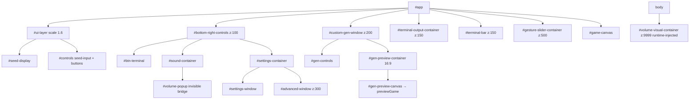
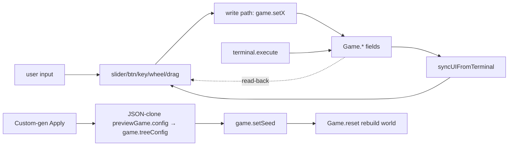

# UI Shell — system

## Goal

Boot the page: construct the [[entities/Game]], wire every UI control (3 modal windows, sliders, terminal, keyboard shortcuts, pointer-lock speed gesture, wheel-volume), maintain a parallel **preview** [[entities/Game]] for the custom generator, and keep all UI knobs in sync with engine state — including after [[systems/terminal]] mutations (via `syncUIFromTerminal`).

## Boundary

**In:** `src/main.ts` (1894 LOC, no exports — Vite entry, side-effects only). `index.html` (13 LOC, near-empty scaffold). The 220-line `innerHTML` template at `main.ts:9-229` defines the entire DOM.

**Out:** [[systems/css-architecture]] owns the visual styling (`src/style.css`, 542 LOC). [[systems/terminal]] owns command logic; UI shell only owns input/output wiring around it. The engine systems ([[systems/game-loop]], [[systems/parallax-layers]], [[systems/procgen]], [[systems/sky]], [[systems/entity-rendering]]) are *driven* from here but don't live here.

## DOM topology



## Data flow



Every numeric control has a **slider ↔ input** pair guarded by `document.activeElement !== X` to avoid clobbering the focused control.

## Control flow — Escape priority stack

```
Escape →
  Terminal open? → close terminal, return
  custom-gen open? → btnGenClose.click(), return
  advanced open? → close advanced, return
  settings open? → close settings, return
  pointer locked? → exit pointer-lock, return
  → native fullscreen exit
```

Order is implicit in source-order; adding a modal means editing this branch.

## Subsystems within main.ts

| Lines | Subsystem |
|---|---|
| 1-5 | Global `error` handler (`alert()` — debug aid that shipped, [[decisions/DEC-03-safe-eval-and-error]]) |
| 9-229 | The 220-line `innerHTML` template |
| 231-238 | Game construction, initial random seed, `start()` |
| 290-340 | Smart-reset button paint (`default` vs `modified`) |
| 376-500 | Advanced speed: non-linear piecewise mapping + `Function(...)` arithmetic eval |
| 532-573 | Volume tri-state (`currentVolume / lastVolume / isMuted`) + speaker SVG swap |
| 655-1393 | Custom-gen window: lazy `previewGame`, biome force, dual-bound Apply (latent bug) |
| 887-1310 | `renderTreeSettings()` — 420-LOC idempotent renderer per tree type |
| 1397-1452 | Basic logarithmic speed slider `10^v` |
| 1473-1596 | Terminal wiring: hints, output, input, `syncUIFromTerminal` |
| 1598-1656 | Terminal keydown FSM: Tab/Space/Enter/ArrowUp/Down |
| 1677-1771 | Global keyboard `f g r s a m t Esc Enter` + Escape priority stack |
| 1773-1835 | Pointer-lock speed gesture (mousedown 200 ms → relative-motion drag) |
| 1844-1893 | Wheel-anywhere volume with lazy-injected `#volume-visual-bar` |

## Failure modes / edge cases

- **Custom-gen Apply listener is bound twice** (lines 698 + 1369) — identical bodies, both fire on click. Latent bug. See [[decisions/DEC-04-main-decomposition]].
- **`alert()` on uncaught error** spams users in production. See [[decisions/DEC-03-safe-eval-and-error]].
- **`Function("use strict"; const {Math.*} = Math; return (expr))()` at line 470** — arithmetic expression eval for advanced speed input. Silently catches everything. Mirror of [[systems/terminal]]'s `speed` eval.
- **Out-of-range speed snaps basic slider to "0"** (looks like 1× speed) — misleading UX. `globalSpeedUpdateCallback` lines 1432-1436.
- **Time-format `'score'` displays elapsed sim time** as if it were a clock — implicit dualism game-time ↔ wall-time. See score as time.
- **`isTreeModified` cactus-specific** for `flowerChance` (`Math.abs(...) > 0.001`). Adding another flower-bearing species silently fails the modified check.
- **`commandHistory` unbounded** — minor leak on long sessions.
- **Lazy DOM injection inside event handlers** (`#volume-visual-container` on first wheel) — unusual when the rest of the DOM is built in one `innerHTML` blast.
- **No accessibility wiring** — buttons rely on `title`, no `aria-label`, no `role="dialog"` on modals, no `:focus-visible`.
- **Pointer-lock not always released on errors** — bound to Escape and gesture-end, but a thrown error mid-drag leaves the cursor captured.
- **Three nearly-identical custom-gen open paths** (`btnCustomGen` click, `g` shortcut, Escape close) duplicate cleanup.

## Invariants

- Single `Game` instance for the main canvas; `previewGame = new Game(canvas, true)` for the preview.
- `currentVolume === 0` when `isMuted === true`; `lastVolume` is the restore value.
- `previewGame.generator.config` is the source of truth for the gen UI; cloned via `JSON.parse(JSON.stringify(...))` into `game.treeConfig` on Apply.
- Terminal mutations *must* trigger `syncUIFromTerminal` — the one inverse-binding contract.
- Keyboard shortcuts inert while an `<input>` is focused (early-return at line 1693), except Escape and Enter.
- Pointer-lock released on gesture end or Escape (lines 1832, 1762).

## Cross-references

- Entities: [[entities/Game]], [[entities/Terminal]], [[entities/Tree]], PreviewGame
- Concepts: default vs modified, slider vs input, preview game mirror, speed mapping, confirm then act, escape priority stack, idempotent render, safe eval, score as time, time format
- Decisions: [[decisions/DEC-03-safe-eval-and-error]], [[decisions/DEC-04-main-decomposition]], [[decisions/DEC-05-low-code-config]], inline html template
- Systems: [[systems/terminal]], [[systems/css-architecture]], [[systems/game-loop]], [[systems/procgen]] (custom-gen writes config)
